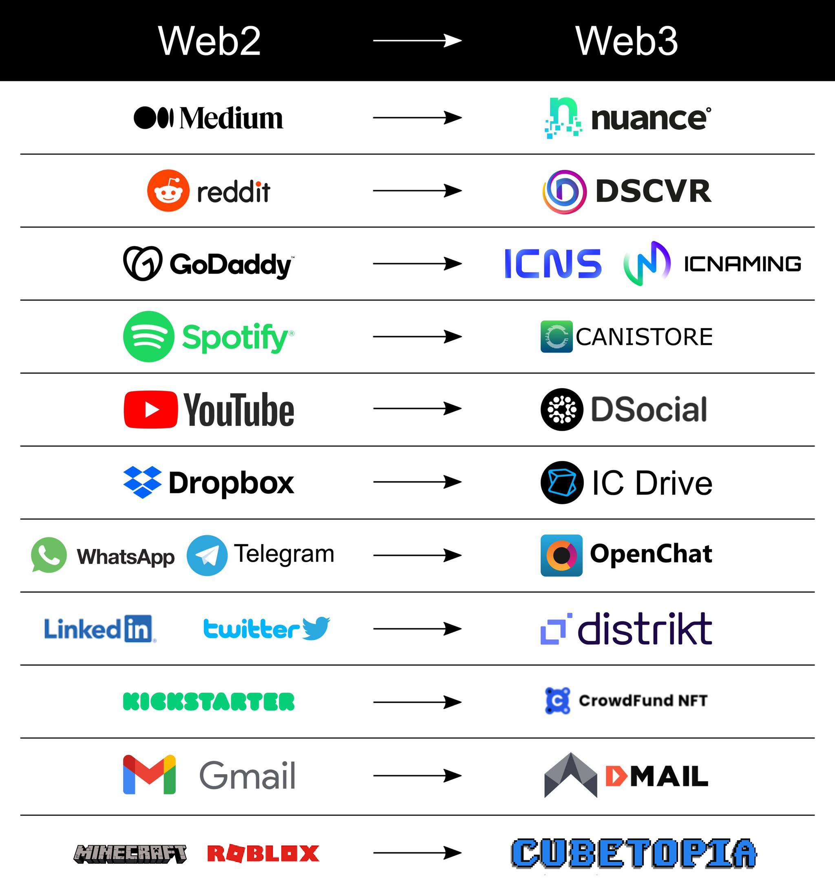

# Day 1️⃣
-  ✍️Comments
- ⛽️ Cycles 
## Welcome to the Motoko Bootcamp 🏕️
[TODO]
## Objectives of the day 
- Understand what is a canister and how it relates to the concept of an actor.
- Understand the concept of cycles & being able to top-up a canister.
- Understand the difference between update & query calls.
- Being comfortable deploying and managing canisters through dfx.
- Understand what is Candid & how to use the Candid UI to interact with your API.
- Understand that Motoko is a typed language and become familiar with the basic types: `Nat`, `Bool` & `Text`
- Understand the differences between `let` & `var`.
## Structure of the day
### Section 1: WebAssembly and why do we need Motoko?
- A high-level view of what is WebAssembly.
- What is WAT?
- Why do we need another language?
- Background & context information about Motoko.
### Section 2: What is a canister?
- Technical explanation (Module & State)
- Messages
- The actor model.
### Section 3: What is an actor?
- Keyword in `main.mo` and how canister/actor are related.
- Actor model
- Update vs Query call.
### Section 4: Variables
- Variables
    - Variable declarations
    - Difference between `let` & `var`.
### Section 5: Types
- Motoko is a typed language.
- Type declaration and type casting by the language.
### Section 6: Nat
### Section 7: Int
### Section 8: Bool
### Section 9: Functions
- Function signature and `func` keyword.
- What does `async` represent?
- Difference between `public` & `private` func.
### Section 10: What is Candid and why do we need it?
- Why do we need Candid? (Rust vs Motoko canisters)
- What is an IDL?
- The Candid file (.did)
- A candid type: `nat` 
### Section 11: Our first project.
### Section 12: Interacting with a canister from the CLI.
### Section 13: Interacting with a canister from the Candid UI.
### Section 14: Useful tools
- Motoko Playground
- Candid UI
### Section 15: What is a DAO? Unlocking the power of DAOs with canisters.
## 👻 WebAssembly and why do we need Motoko? 
Before we dive into **Motoko** - we actually need to explain another term: **WebAssembly**. <br/>

<p align="center">  </p>

The **Internet Computer** is a platform that hosts a large number of applications, all of them run within special containers called **canisters**. A **canister** is composed of memory and code - the code that is installed on the **Internet Computer** is a **WebAssembly module** (usually written as **WASM**). <br/>

<p align="center">  </p>

**WebAssembly** is a low-level binary format for executing code in multitude environments (browsers, cloud platform, smart devices, virtual machine..). 
The main benefits of using **WebAssembly** are:
- **WebAssembly** supports code written in multiple languages (C, C++, Rust, Motoko) making it a versatile solution for developers.
-  **WebAssembly** code is portable and can run on almost any device. You write it once and you can run it everywhere! 

<p align="center">  </p>
<p align="center"> Developer life has become easier! </p>


- **WebAssembly** is fast. It's a language that is very close to machine language and has been optimised for speed and performance. You can use it for creating complex and intensive applications (Games, simulations, graphic)! 
- **WebAssembly** provides a secure execution environment, by putting the code in a special area called a **sandbox**. The **sandbox** makes sure that the program is only able to do things and access resources that is has been granted access to and doesn't allow it to access sensitive informaiton. This helps a lot when trying to write secure code or for users to make sure they won't get harmed by the code running on their machine!  

**WAT** (**WebAssembly Text Format**) is a human-readable representation of **WebAssembly** code. It's an alternative to the binary format that **WebAssembly** code is usually stored in, and it provides a more accessible way of reading and writing **WebAssembly** code. **WAT** code is written in a simple text format and it can be easily edited and manipulated using a text editor. This makes it easier for developers to understand and debug **WebAssembly** code, as they can see exactly what the code is doing in a format that they're familiar with.

**WAT** code is then compiled into binary **WebAssembly** code that can be executed in a virtual machine. <br/> However, even when using **WAT**, **WebAssembly** is a low-level language and it provides very little abstraction, making it difficult to use for writing complex applications like dApps (decentralized applications). This is where a new language like Motoko comes in.
In the following example, here is a **factorial** function, illustrated in Motoko and WebAssembly (Textual & Binary). <br/> Don't freak out if you don't understand anything - that's normal:

<table align="center">
  <tr>
    <th> Motoko </th>
    <th>WebAssembly (Textual)</th>
    <th>WebAssembly (Binary)</th>
  </tr>
<td><pre>
func factorial(n : Nat) : Nat {
    if(n == 0) {
        return 1
    } else {
        return factorial(n - 1);
    }
};
</pre></td>
<td><pre>
get_local 0
i64.const 0
i64.eq
if i64
    i64.const 1
else
    get_local 0
    get_local 0
    i64.const 1
    i64.sub
    call 0
    i64.mul
end
</pre></td>
<td><pre>
20 00
42 00
51
04 7e
42 01
05
20 00
20 00
42 01
7d
10 00
7e
0b
</pre></td>
</tr>
</table>
<p align="center"> What do you think? Does writing this function seem easier with Motoko? Or maybe you prefer WebAssembly? </p>

That's why the [DFINITY Foundation](https://dfinity.org/) has introduced a new language called **Motoko**, which is a programming language specifically designed for creating decentralized applications (dApps) on the Internet Computer. Since Motoko code can directly be compiled into **WebAssembly**, it is an incredible language to build on the Internet Computer. 

<p align="center">  </p>
<p align="center"> In Motoko the code is spun, Into WebAssembly it does run.</p>

> It's worth noting that the WebAssembly standard, was co-designed by [Andreas Rossberg](https://github.com/rossberg), who joined the DFINITY Foundation early in 2017 to work on the execution environment for canister and is also the original designer of the Motoko language. What a brilliant mind! 

A Motoko file is a file with the extension .mo

<p align="center">  </p>

**Motoko** is a high-level language such as **JavaScript** or **Python**. It is generally considered easier to learn than a lower level language like **Rust** or **C**. 

---
<i> Motoko has a cool mascot that has been intensively used and modified in the community, for all sort of purposes!
So not only will you be able to build cutting-edge decentralized applications with Motoko, but you'll also have the coolest logo in the game. Don't believe us? Just check out the [Motoko NFT market](https://entrepot.app/marketplace/motoko) and see for yourself. </i>

[TODO: ADD OVERVIEW OF ALL MOTOKO RELATED PROJECTS]
## 🥫 What is a canister? 
The concept of **canisters** is fundamental to understanding how dApps on the Internet Computer are developed. 
<p align="center">  </p>
<p align="center"> You'll understand every section on this picture before the end of this section - promised!</p>

A canister is composed of:
- A **WebAssembly** module which is a piece of compiled code from languages such as Rust or Motoko (as we've seen before). This is the code that is installed in the canister and is ultimately running on the network.
- A **WebAssembly** memory - also called memory pages. This is where the state of the canister is stored and files are stored (photos, videos, tokens...). Code runs by the WebAssembly module can modify the memory.

> A **WebAssembly** module can be replaced by a new one while keeping the memory intact - this is what enables canisters to be upgraded without losing their data! [TODO: ADD AN ANIMATION]

Users will interact with canisters by sending and receving messages. This happen whenever you use an application on the **Internet Computer** and interact with it - a few examples of such interactions are:
- When you post on a social network. 
- When you send a token to another address.
- When you trade an NFT.
- When you read content on a website hosted on the **Internet Computer**.
- And way more...

<p align="center">  </p>
<p align="center"> OpenChat is a decentralized messaging application built on the Internet Computer. </p>

> You can inspect the messages that you send to the Internet Computer by using a tool called [IC Inspector](https://chrome.google.com/webstore/detail/ic-inspector/meaadkenfkhjakkkdapaallimhbdofck). IC Inspector is a browser extension that enables you to inspect the messages you've sent & received and information about them (canister of destination, payload...).

A message sent to the Internet Computer contains the following informations:
- ID of the **canister** of destination.
- Name of the function called on this **canister**.
- Arguments provided for the function.
- **Principal ID** of the caller. 

[TODO: Add illustration]

To verify the authencity of the message, it also contains an envelope which includes:
- The public key of the caller.
- A signature of the **caller** under his public key.

[TODO: Add illustration]

<p align="center">  </p>
<p align="center"> Posting something on OpenChat creates a message added to the next group of blocks, executed by a canister after network agreement. </p>

When an user call a canister, it is important to distinguish two types of calls:

- **Update calls**: those calls are used when the user wants to modify the state of a canister. To ensure the integrity of the **Internet Computer**, these calls must be processed through consensus and by all nodes, which results in a delay of around 1-2 seconds. An update call would be used in the following situations:
    - Posting on social media.
    - Uploading a video.
    - Liking or sharing a content. 
    - Transfering a token.

[TODO: Add illustration]

- **Query calls**: This type of call is used when a user wants to read data without modifying the state. These calls can be answered by a single node, making them very fast. A query call would be used in the following situations:
    - Reading an article.
    - Checking your user profile. 
    - Loading a video or a picture.

[TODO: Add illustration]
## What is an actor? 🤖
If you open a Motoko file, there is a high probability that the first word that you will read is `actor`:
```
actor {

    /// CODE

};
````
An **actor** is how a canister is represented and abstracted in **Motoko**. This terms comes from the [Actor model](https://en.wikipedia.org/wiki/Actor_model) which is a way to write computer programs that can handle many tasks at the same time. It does this by treating **actors** as the basic building blocks of a program. <br/>
An actor is a small computer program that can receive messages, do some work and then send messages to other actors. Actors can also create new actors and control them. All the actors talk to each other by sending messages. Since all interaction between actors is done via message passing, this allows for very high levels of concurrency and parallelism, making it well-suited for distributed systems. In that regards, **the Internet Computer is a distributed computer where each program is a canister !** 

<p align="center"> </p>
<p align="center">A canister receives a message, execute it, and possibilty send other messages to other canisters (or even create new ones) in response. </p>

Let's consider the following actor:
```motoko
actor {
    var message : Text = "Hello Motoko Bootcamp!";

    public func changeMessage(t : Text) : async () {
        message := t;
    };

    public query func readMessage() : async Text {
        return message;
    };
};
```
We can see that this actor has:
- One variable called `message`, that is initialized to a value "**Hello Motoko Bootcamp**".
- Two public functions:
    - `changeMessage` which updates the value of `message`to whatever is provided as argument.
    - `readMessage` which shows the value of `message` without modifying it. 

The `public` keyword indicates that both functions can be called from the outside by users or other canisters. The `public` functions of an actor represents the [API](https://en.wikipedia.org/wiki/API) of a canister. 

> Do you remember what we've said earlier about the two types of calls? <br/>Notice how the `query` keyword indicates that the function `readMessage` will only be used for reading information. On the other hand, we don't need to precise that `changeMessage` will be used for modifying the state as it is assumed by default.

We have deployed this actor on the Internet Computer - and you [can access his interface](https://a4gq6-oaaaa-aaaab-qaa4q-cai.raw.ic0.app/?id=rhjue-eaaaa-aaaaj-qazra-cai)! 

> Try playing with it and see the difference in speed between update & query. Leave a nice message for the next student 🙏

## 📦 Variables
Variables can be declared using either `let` or `var` keyword, followed by the assignment operator `=`

- Variables declared with `let` are immutable, meaning that their value cannot be changed once they are assigned. 
```motoko
let n = 1;
```
- Variables declared with `var` are mutable, their value can be reassigned to a new value at any time using the reassignment operator `:=`.

```motoko
var n = 1;
n := 2;
```

> The syntax convention is to use `lowerCamelCase` for variable names & to use spaces around the `=` sign.

If we try the following code:
```motoko
let n = 1;
n := 2;
```

An attempt is made to reassign a value to an immutable variable - that's why an error will occur. The specific error message will be `type error [M0073], expected mutable assignment target`. This  message indicates that the variable being reassigned is immutable and cannot be changed.

> Whenever you declare a variable don't forget to end the declaration with `;` otherwise Motoko will complain.

## 🍎 Types
The **Motoko** language places a strong emphasis on types and is more strict in enforcing them compared to other general-purpose languages like **JavaScript** or **Python**. This strictness serves a purpose, as it helps prevent errors and issues.

<p align="center">  </p>
<p align="center"> A few primitive types</p>

Each variable is assigned a specific type, which is determined before the program runs. The compiler checks each use of the variable to avoid errors that may occur during runtime.

To assign a type to a variable we use the `:` symbol - as in the following examples: 
```motoko
let age : Nat = 20;
let message : Text = "Of all the acts, the most complete is that of building";
let open : Bool = false;
```
You can generally omit the type declaration - the compiler will automatically assign a type to the variable based on the first value that you provide:
```
let age = 20;   // Will be assigned type Nat
```
> For the duration of the Bootcamp it is recommended to keep all type declarations to make things clearer, especially if you are new to typed languages.

You will also quickly notice that types must always be indicated for the argument(s) & return value(s) of a function as we've seen in our example earlier.

## <a id="nat"> 🔢 Nat </a>
`Nat` is used for **unbounded** natural numbers (1,2,3,4,...♾️). By default all positive whole numbers are casted to `Nat`.

```motoko
let n : Nat = 1;
```
Is equivalent to 

```motoko
let n = 1; // Will be casted to Nat automatically
```

**Unbounded** means that value of type `Nat` will never [overflow](https://www.youtube.com/watch?v=WN8i5cwjkSE). The memory representation used will grow to accommodate any finite number. Motoko also has the concept of **bounded** natural numbers (`Nat8`, `Nat16`, `Nat32`, `Nat64`) that we will cover later.

If you try to assign a negative number to a `Nat` the program will trap. 

```motoko
let n : Nat = -1;
```
`literal of type Int does not have expected type Nat`

`Nat` supports usual operations:
- Addition: you can add two numbers using the addition operator `+`

```motoko
let a : Nat = 1 + 1;    //2
```
- Subtraction: you can subtract two numbers using the subtraction operator `-`
```motoko
let a : Nat = 10 - 2;   // 8
```
> Be careful with substractions. `Nat` only plays with the positive numbers. If the result of the subtraction is less than zero, it won't fit. The value will no longer be of the `Nat` type and that could cause trouble if your program is expecting a value of the `Nat` type. 

- Multiplication: you can multiply two numbers using the multiplication operator `*`
```motoko
let a : Nat = 10 * 10;  //100
```
- Division and modulo: to divide two numbers, you can use the division operator `/` and to find the remainder of a divided by b, you can use the modulo operator `%`
```motoko
let a : Nat = 10 / 2;   //5
let b : Nat = 3 % 2;    //1
```

## <a id="int"> ➖ Int </a>
Integers represents whole numbers that can be positive or negative. The same mathematical operations seen earlier (addition, multiplication, subtraction, division, and modulo) can be performed on both `Int` and `Nat`.

```motoko
let i : Int = -3; 
let j : Int = 5;
```

> Since `Int` includes positive and negative whole numbers it includes all value of type `Nat`. We say that `Nat` is a subtype of `Ìnt`.

`Ìnt` is also an unbounded type and has bounded equivalents that we will cover later (`Int8`, `Int16`, `Int32`, `Int64`).

## 🚦 Bool
A `Bool` is either `true` or `false`. `Bool` stands for boolean and this data type only contains two values.
```motoko
let light_on : Bool = true;
let door_open : Bool = false;
````

Booleans can be used and combined with logical operators:

- `and`
```motoko
let result = false and false;   //false
```
```motoko
let result = true and false;    //false
```
```motoko
let result = false and true;    //false
```
```motoko
let result = true and true;     //true
```
- `or`
```motoko
let result = false or false;   //false
```
```motoko
let result = true or false;    //true
```
```motoko
let result = false or true;    //true
```
```motoko
let result = true or true;     //true
```
- `not`

```motoko
let result = not true;      //false
```
```motoko
let result = not false;     //true
```

`Nat` and `Int` supports comparison operators, which compare two integers and returns a `Bool`: 
- The `==` (equality) operator which indicates if two values are equal.
- The `!=` (not equal) operator which indicates if two values are different.
- The `<` (less than) and `>` (more than) operators.
- The `<=` (less than or equal to) and `>=` (more than or equal to) operators.

```motoko
3 < 5   // true
1 >= 1  // true
1 != 1  // false
2 == 10/5   // true
```

> The `==` operator is very different from the `=` operator. The first will test if two values are equal while the later will asign a value to a variable.
## ⚙️ Function
Here is an actor that is responsible to keep track of a counter. 
```motoko
actor Counter {
    var count : Nat = 0;

    public func increaseCount() : async Nat {
        count := count + 1;
        return (count);
    };

    public query func showCount() : async Nat {
        return (count);
    };
};
```
The keyword `func` is used to declare functions, followed by the name given to the function. 

> The syntax convention for functions is to use `lowerCamelCase` as for variables.

In Motoko, to declare a function you always have to indicate the types of arguments and return values. 
In the case of `increaseCount` & `showCount` there is no argument so we can leave it blank however as you can see we've indicated the type of the return values: `async Nat`.  <br/>

You may be confused about the use of `async Nat` as the return type instead of simply `Nat`. The term `async` refers to asynchronous programming.

In the context of the **Actor model** we discussed earlier, **canisters** or **actors** communicate asynchronously. This means that when one canister sends a request to another, the caller will have to wait a brief period before receiving a response.  <br/>

Asynchronous programming allows you to run your code in a non-blocking manner. The `async Nat` type of the return value for the `increaseCount` or `showCount` functions indicates that the caller must wait for a response. The response will eventually be a value of type `Nat`, but with a delay, hence the type is `async Nat`.

While the canister waits for a response, it is able to execute other messages. Once the response is received, it will resume the operation it was performing.

> All public functions declared in the body of an actor must be of return type `async`.

The body of the function is a set of instructions executed when the function is being called. It corresponds to the entire code between the brackets `{ }`
In our example, for the `increaseCount` we have 2 instructions:

1. Increase the value of `count` by one.
2. Return the current value of `count`.

Motoko allows to omit the `return` at the end of the body of the function, because a block always evaluates to its last expression. Which means, we could rewrite the code in the following way and it would still be valid:

```motoko
actor Counter {
    var count : Nat = 0;

    public func increaseCount() : async Nat {
        count := count + 1;
        count;
    };

    public query func showCount() : async Nat {
        count;
    };
}
```

Here is another shortcut that we can use to make the code shorter. 
```motoko
count = count + 1;
```
Can be replaced by the following syntax
```motoko
count += 1;
```
The reduced version of the code would look like this:
```motoko
actor Counter {
    var count = 0;

    public func increaseCount() : async Nat {
        count += 1;
        count;
    };

    public query func showCount() : async Nat {
        count;
    };
}
```
## 👽 What is Candid and why do we need it? 
Let's imagine the following situation:

- We are writing a canister in **Motoko** and we have defined a value `n` of type Nat.
```motoko
let n : Nat = 5;
```
- We know  another canister that exposes a public function `square` that returns the `square` of the number provided - this canister is written in **Rust**.

We want to compute the square of our value `n`, but we are very lazy and we don't want to implement the `square` function in the **Motoko** canister, instead we want to make use of the already existing function in the **Rust** canister. That's possible and it will make use of **intercanister-calls** (a more advanced concept that we will see in more details in another lesson).

The problem is the following: `n` is of type `Nat`and the `square` function only accepts value of type `u128`. But, in **Motoko**, the type `u128` doesn't exist! It it is like trying to communicate in Spanish with someone that speaks Chinese.

> Composing services (i.e canisters) written in different languages is central to the vision of the **Internet Computer**. How do we solve this fundamental communication issue between canisters?

We need to introduce an **Interface Description Language (IDL)**. An interface description language (**IDL**) is a generic term for a language that lets a program written in one language communicate with another program written in another unknown language.

**Candid** is an **IDL** describing the public services deployed in canisters on the **Internet Computer**. The Candid interface allows inter-operation between services, and between services and frontends, independently of the programming language used.

A **Candid** file is a file with the .did extension - we can define the interface of the `square` canister with the following .did file:
```candid
service : {
  square: (nat) -> (nat) query;
}
```

In this case, our service has a unique function named `square`. This function takes a `nat` and returns a `nat`. Notice that we also use the keyword query to provide more information on the function. 

The `nat` used here is not the same as the `Nat` type in **Motoko**, or any type in **Rust**. If the `square` canister was written in Motoko the Candid interface would be exactly the same. The description of the service is independent of the language it was written in - this is key!

Candid solves the problem we've raised earlier by enabling a mapping between types in different languages.

<p align="center">  </p>

The type `u128` will be converted to `nat` which is then converted to `Nat` in the **Motoko** canister. This makes it possible to write the following code:

```motoko
actor {
    let n : Nat = 5;

    //We define the other canister in our own code.
    let rustActor : actor = {
        square : Nat -> Nat;    // We use Motoko types here  
    };

    public func getSquareOfN() : async Nat {
        await rustActor.square(n);  //This is how easily you can call another canister - pretty cool, right?! 
    };

};
```

[TODO: ADD RECAP INFORMATION]

> Candid is sometimes called "**the language of the Internet Computer**" as it how canisters communicate with each other. You will rarely have to write Candid but it's important to understand why Candid was created, how to read it, and how it works since you'll encounter Candid files in the projects you will work on. 

## 🎬 Our first project
Now that we have reviewed some fundamental concepts, we are ready to start experimenting with our first project.

1. Verify that you have `dfx` installed
```bash
$ dfx --version
dfx 0.12.0
```
> If you have a different version, that's not a problem. As long as you have a version printed, the next commands should work. If you don't, make sure that you've correctly installed `dfx`.

2. Generate a new folder called `first_project`
```bash
$ mkdir first_project
```

3. Move into your newly generated folder. 
```bash
$ cd first_project
```
4. Create two files `dfx.json` & `main.mo`:
```bash
$ touch dfx.json && touch main.mo
```
5. Copy & paste the following code in your `dfx.json` file
```json
{
    "canisters": {
      "MegaCounter": {
        "main": "main.mo",
        "type": "motoko"
      }
    }
  }
```
The `dfx.json` file is a configuration file that is used by `dfx` to gather information about your project. You'll always have one `dfx.json` file per project, even if you have lots of canisters.
The first word is "**canisters**" which opens a bracket `{` into which you'll provide the list of your canisters, separated by a comma `,` .<br/>
In this example, we only have one canister, we can give it the name that we want so we will call it `MegaCounter`. 
This canister is of type `motoko` and the main file is located in the same folder and called `main.mo`.
The main file, is always the file where the `actor {}` is defined. We will see later that we can import other files in the main one, called **modules**. <br/>
One main.mo file = One actor = One canister! 

6. Copy & paste the following code in your `main.mo` file
```motoko
actor MegaCounter {
    var i : Int = 0;

    public func add(j : Int) : async Int {
        i := i + j;
        i;
    };

    public func div(j : Int) : async Int {
        i := i / j;
        i;
    };

    public func reset() : async () {
        i := 0;
    };

    public query func show() : async Int {
        i;
    };
};
```

7. Start your local replica
```bash
$ dfx start
Running dfx start for version 0.12.0
Using the default definition for the 'local' shared network because /Users/seb/.config/dfx/networks.json does not exist.
Dashboard: http://localhost:57765/_/dashboard
```

> You can click and access the dashboard. It will give you information about your local replica (replica version, canisters deployed, number of consensus rounds since start..)


8. Create an empty canister for `MegaCounter`
```bash
$ dfx canister create MegaCounter
Creating a wallet canister on the local network.
The wallet canister on the "local" network for user "seb" is "rwlgt-iiaaa-aaaaa-aaaaa-cai"
Creating canister MegaCounter...
MegaCounter canister created with canister id: rrkah-fqaaa-aaaaa-aaaaq-cai
```
`dfx` will automatically create a wallet for your `identity`. A wallet is necessary to hold cycles, which are necessary to create canisters. Only canisters can hold cycles and not your identity - that's why you need this wallet which acts as a proxy when you create and deploy canisters.

9. Compile your code into WASM. 
```bash
$ dfx build MegaCounter
Building canisters...
Shrink WASM module size.
``` 
After this step, your Motoko file is compiled into a WebAssembly module, which size is optimised. You can find the module under `.dfx/canister/MegaCounter/MegaCounter.wasm`

> If you wanna know what is actually inside the module. You can [convert your WASM to the WAT format](https://webassembly.github.io/wabt/demo/wasm2wat/) that we have mentionned earlier.

10. Install the WASM inside the canister.
```bash
$ dfx canister install MegaCounter
Creating UI canister on the local network.
The UI canister on the "local" network is "ryjl3-tyaaa-aaaaa-aaaba-cai"
Installing code for canister MegaCounter, with canister ID rrkah-fqaaa-aaaaa-aaaaq-cai
```

**Congratulations! Your canister in now deployed.**

The **Candid** interface, as previously mentioned, allows inter-operation between services, and between services and frontends. **Candid** is also very useful for calling the canisters from different places:

- Using the terminal with `dfx`.
- Using the **Candid UI**.
- Using a frontend (webpage) with the **JavaScript Agent**.

## 📺 Using the terminal (dfx)
The Candid interface allows you to call backend services or functions from the command line. This is useful for administrative tasks that do not require a front end or for testing the back end. In the example of the `MegaCounter` dApp, you can call the `add` method by running the following command:

```bash
$ dfx canister call MegaCounter add '(3)'
(3 : int) 
```
As you can probably guess from the previous example, the format for calling canisters using `dfx` is the following:
```bash
dfx canister call NAME_OF_CANISTER NAME_OF_FUNCTION '(ARGUMENTS)'
```
Notice that you should put your arguments betwen `'()'` an the format for arguments is the **Candid** syntax, the returned type is `int` and not `Int` like in Motoko. This distinction will matter more when we will deal with complex arguments (object, tuples, arrays..).

If you want to call a canister on the main net, you need to add the `--network ic` flag:
```bash
dfx canister --network ic call NAME_OF_CANISTER NAME_OF_FUNCTION '(ARGUMENTS)'
```

As we've seen before, we can **trap** the canister if we try to divide by 0.
```bash
$ dfx canister call MegaCounter div '(0)'
Error: Failed update call.
Caused by: Failed update call.
  The Replica returned an error: code 5, message: "Canister rrkah-fqaaa-aaaaa-aaaaq-cai trapped: integer division by 0"
```
An important thing to note, is that the canister persits it's state by default. If we send another command:

```bash
$ dfx canister call MegaCounter add '(5)
(8 : int)
```
We can see that the value of `counter` is 8 - which corresponds to the two commands we've run so far. 
This property is called **orthogonal persistence**. Orthogonal persistence creates an illusion that a program runs forever without crashing or losing state. If you don't send command to your canister, it will kept the value of `counter` to 8 forever. 

> Orthogonal persistence sounds like a complicated term but in practice it means “just write code”. You don’t need to build a database at all.

11. Copy & paste the following code in your `main.mo` file
```motoko
actor MegaCounter {
    var i : Int = 0;

    public func add(j : Int) : async Int {
        i := i + j;
        i;
    };

    public func sub(j : Int) : async Int {
        i := i - j;
        i;
    };

    public func mult(j : Int) : async Int {
        i := i * j;
        i;
    };

    public func div(j : Int) : async Int {
        i := i / j;
        i;
    };

    public func reset() : async () {
        i := 0;
    };

    public query func show() : async Int {
        i;
    };
};
```

12. Recompile the code 
```motoko
$ dfx build MegaCounter
```

13. Upgrade the canister with the new module
```motoko
$ dfx canister install MegaCounter --mode upgrade
```

Now that we have upgraded our canister, if we look at the value of `counter` (
```motoko
$ dfx canister call MegaCounter show 
(0 : int)
```

Orthogonal persistence has limitations! When we upgrade our canister, the state is wiped out and we start from 0 again. We will see in a future lesson that we can solve this issue, by using **stable memory** which is a memory that persists between upgrades. 

In the meantime, or more information about how to call canisters from the command-line, you can read the [documentation](https://internetcomputer.org/docs/current/references/cli-reference/dfx-canister) or simply run: 

```bash
$ dfx canister --help
```

## 📲 Candid UI

While the command-line can be very practical, there's also an easier way to call the backend services, and that's by using the Candid UI. When a project is deployed, besides the Candid interfaces, an asset canister running the Candid UI is also deployed. The built process will show the URL in the console, but the URL can also be found in `/.dfx/local/canister_ids.json`:
```json
{
  "MegaCounter": {
    "local": "rrkah-fqaaa-aaaaa-aaaaq-cai"
  },
  "__Candid_UI": {
    "local": "ryjl3-tyaaa-aaaaa-aaaba-cai"
  }
}
```

[TODO : FINISH SECTION]

## 🛝 Motoko Playground
For testing smaller code snippets, or testing some ideas, Motoko Playground can be very useful. You can write Motoko code in the editor, and deploy it to canisters without going through the steps of manually deploying the code to either the local or main net. All public functions/services can be tested with the built-in Candid UI.

# 🧩 What is DAO? Overview of the NNS

> During this week you will have the opportunity to build a prototype for a Decentralized Autonomous Organization (DAO). This is why we want to answer an important question: **What is a DAO?**

## 🏛️ Decentralized Autonomous Organization: a new model of governance?

<p align="center">  </p>

Throughout history, humans have find different creative ways to organize in social groups and structures. They have done so different reasons such as safety, support, social identity, work, power or even economic. A few common groups include: family unit, tribes, clans, states, guilds, secrect societies, political parties...

With the advent of the Internet, social networks, cryptocurriencies & smart contracts many believe that a new type of organization is about to start a new chapter of human history: **DAO**. 

A Decentralized Autonomous Organization (DAO) is a digital organization that is composed of members living all around the world, and is governend and organized by smart contracts. 

Because smart contracts execute automatically, are decentralized, transparent, can't be censored or modified by any individual the same applies to **DAOs** in the sense that they are not controlled by any single individual or entity, they rather operate based on the collective decision-making of their members.

A few usecases for DAOs include:

- **Decentralized venture capital**: DAOs can be used to enable decentralized venture capital funds, in which members can propose and vote on investments in projects. [The DAO](https://en.wikipedia.org/wiki/The_DAO_(organization)) was one of the first DAOs to be created and was designed to be a decentralized venture capital fund, although it was controversial and ultimately failed due to a hack.
 
- **Decision-making**: DAOs can be used to enable members to make decisions about the direction of a project or organization. For example, MakerDAO is a decentralized finance (DeFi) platform that is built on the Ethereum blockchain and is governed by a DAO, in which members can vote on proposals to change the parameters of the MakerDAO system, such as the interest rates on loans.

## 🙁 Limitations of DAOs
As we've said DAOs are formed through smart contracts. However, smart-contracts are pretty limited:
- They can't store any meaningful amount of data (photos, videos, files...). [The cost of storing 1GB of data in the Ethereum blockchain has been estimated at around $5.5M](https://steemit.com/ethereum/@suryanshkumr/you-need-usd5-5m-to-save-1gb-data-in-ethereum-blockchain-d)
- It is not possible to interact with a smart contracts directly from a browser. A wallet needs to be installed and acts as relay.
- Smart contracts rely on oracles to gather information from the external world and facilitate communication with it, as they are unable to interact with anything outside of the blockchain on their own. 
- Smart contracts are limited in term of computational  power they have access to. 

Those technical limitations results in concrete actions that a DAO would be unable to do: 
- 🌳 **Interact with the physical world**: DAOs are limited to the digital world and cannot interact with the physical world. A DAO could not plant a tree, turn on a light switch, or deliver a physical letter.
- 📲 **Access external data sources**: For example, a DAO could not retrieve the current temperature from a weather website, or the current stock price from a financial website.
- 🔮 **Use advanced computational power**: For example, a DAO could not run simulations to predict the outcome of a complex system, such as the spread of a pandemic or the performance of a financial portfolio.
- 🗂️ **Handle large amounts of data**: For example, a DAO could not store and process the complete medical records of millions of patients.

Those important limitations are preventing DAOs to have a meaningful impact in the world. 

## 🚀 From smart-contracts to canisters
Imagine that smart-contracts could:
- Store unlimited amount of data & run any computation.
- Be accessible directly from any browser.
- Communicate with the external world trough HTTP requests.
- Create and sign transactions on any blockchain (Bitcoin, Ethereum...).
- Being upgradable to constantly add new features & fix potential bugs.
- Remove fees and enable anyone to interact with them. 

Does it sound interesting? Welcome to the fabulous world of **canisters**! <br/>

<p align="center"> </p>
<p align="center"> Imagine what DAOs will be able to achieve using canisters!</p>
By using canisters, DAOs are now able to control entire web applications.

This means that future web services (social network, search engine, games, mail client, messaging application...) can run entirely on a set of canisters, where the governance of those canisters is ensured through a tokenized public governance canister.  <br/>

<p align="center">  </p>

This concept is called Open Internet Services. The aim is to end the current monopoly of BigTech companies (Facebook, Google, Apple, Twitter, Microsoft, Tiktok... ) that profits from the centralized aspect of the Internet. By aligning incentivizes between investors, users, and developers, those services are expected to operate in a more transparent, privacy-friendly and cooperative manner.

<p align="center">  </p>

> **A prediction?** <br/> Open Internet Services are powerful and won't stop with social networks or messaging apps. They are here to revolutionize the way we work and live together. With unprecedented scalability of collaborative work enabled by the combined power of DAOs and OISs, the sky's the limit! Imagine the positive impact on humanity with projects like environmental conservation, medical research, and education all being amplified by this new level of coordination and collaboration. And this is just the tip of the iceberg, as this new technology could open the door to even more innovative solutions to some of the world's most pressing problems. This is an opportunity to make real progress and change the world in ways we never thought possible before. **Get ready, the future is here!**