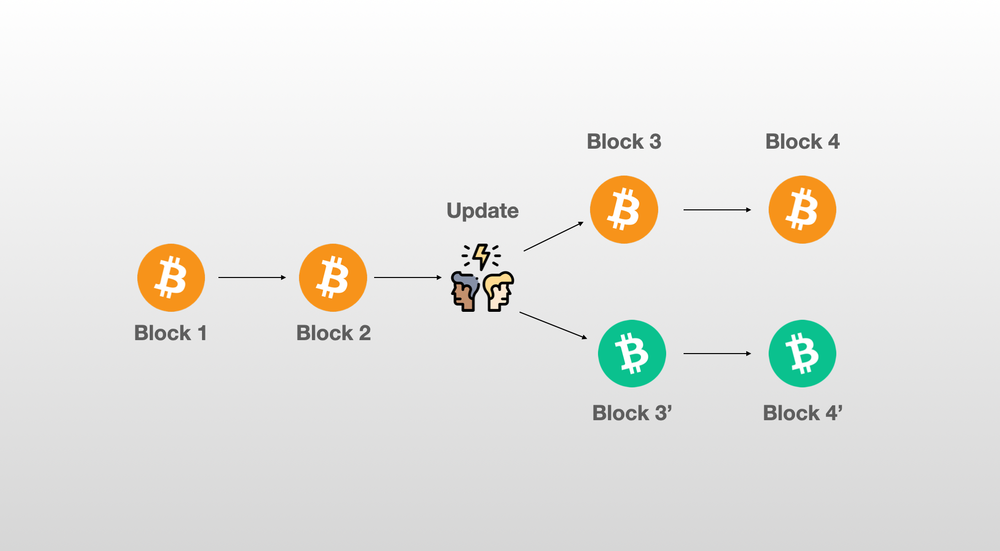
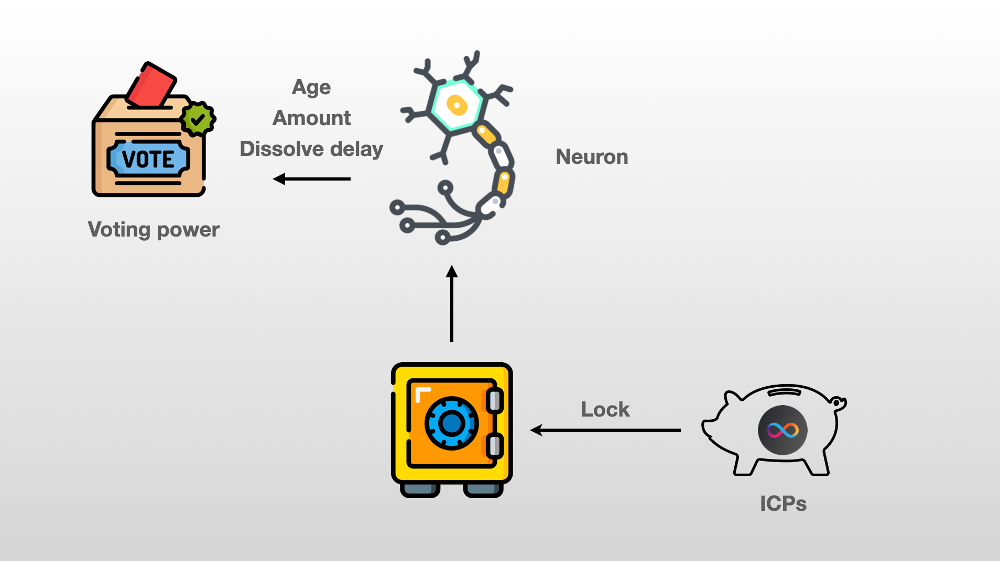
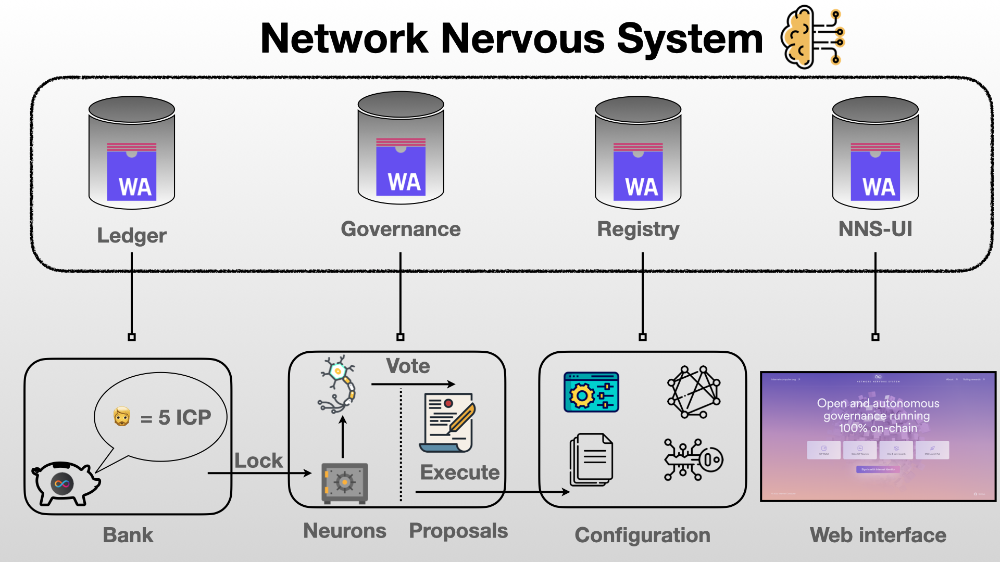

# Day 2️⃣

- Union type
- Intersection type

## 📚 Base library
Yesterday, we've only looked at operations that are built-in to the language. To perform more complex operations, we'll need to import and use modules, especially those from the [Base library](https://internetcomputer.org/docs/current/motoko/main/base/).

The Base library is a set of modules & functions that provide functions for commonly used types (such as `Bool`, `Nat`, `Int`, `Text` and more).

A module is a collection of code written by someone else that you can use in your own program. <br/>
We will explore different methods for importing modules and even creating our own modules, but for today we will focus on importing modules from the **Base** library.

The source code for this library is [available on Github](https://github.com/dfinity/motoko-base/) and is maintained by engineers from the DFINITY foundation and community members. 
<br/>
Each module has its own documentation page, where you can learn about the available functions. For example, here is the [documentation page for the Nat module](https://internetcomputer.org/docs/current/motoko/main/base/Nat).

<p align="center"> </p>

> The source code is meant to understand how a specific module was written, whereas the documentation is meant to understand how you can use a module.

There is a module for each type: 
- A module `Nat` corresponding to operations on `Nat`.
- A module `Int` corresponding to operations on `Int`.
- A module `Text` corresponding to operations on `Text`.
- A module `Char` corresponding to operations on `Char`.
- And way more..

Importing a module is done at the top of the file before the `actor` declaration.
```
import Nat "mo:base/Nat";
actor {
    public func convertToText(n : Nat) : async Text {
        return Nat.toText(n);
    };
};
```
## 🔎 Debug 
**Debug** is a module that provides utility functions for debugging and printing informations. 

`Debug.print()` will print text to the output stream (i.e your terminal).

```motoko
import Debug "mo:base/Debug";
actor {
    Debug.print("Hello!");
};
```
<p align="center"> </p>
<p align="center"> The text will be printed in the same tab that is running your replica. Make sure to check out the correct place!</p>

> Unfortunately, `print` can only be used locally. On the mainnet or when using Motoko Playground there is no concept of output stream so `Debug.print` has no effect.

`Debug.print()` only accepts a value of type `Text` as input. If you have any  object, you can use the `debug_show` command to automatically convert it to `Text`. 
```motoko
let array : [Nat] = [19, 8, 2, 5];
Debug.print(debug_show(array));
```
You can also use convertion functions
```motoko
import Nat "mo:base/Nat";
import Debug "mo:base/Debug";
actor {
    let n : Nat = 5;
    Debug.print(Nat.toText(n));
}
```
## 💬 Text 
In Motoko, strings can be written surrounded by double quotes `"`
```motoko
"Hello Motoko Bootcamp!"
```
The type for string is `Text` (pretty easy to remember).
```motoko
let welcomePhrase : Text = "Hello Motoko Bootcamp!";
```

We can use the concatenation operator `#` to join two `Text` together.
```motoko
let firstName : Text = "Motoko";
let surname : Text = "Bootcamp";
let completeName : Text = firstName # surname;
```

We can access the size of a `Text` by calling the `.size()` method.
```motoko
let name : Text = "Motoko";
let size = name.size()  // 6
```
## 🔤 Char
A value of type `Text` is actually composed of values from another type: `Char`. A `Text` is the concatenation of multiple characters. Characters are single-quote delimited `'`
```motoko
let character_1 : Char = 'c';
let character_2 : Char = '8';
let character_3 : Char = '∏';
```
`Char` are represented by their [Unicode code points](https://deliciousbrains.com/how-unicode-works/). We can use the `Char` module from the Base library to check the unicode value. 
```motoko
import Char "mo:base/Char";
import Debug "mo:base/Debug";
actor {
    let a : Char = 'a';
    Debug.print(debug_show(Char.toNat32(a)));   // 97
}
```
We can easily iterate over all the characters in a `Text`, by calling the `chars()` method. We can then use this iterator to create a `for` loop.
```motoko
import Debug "mo:base/Debug";
import Char "mo:base/Char";
actor {
    let name : Text = "Motoko";
    for (letter in name.chars()){
        Debug.print(Char.toText(letter));
    };
};
```
> Notice how when we iterate `letter` is a `Char` and we need to convert it back to `Text` to use `Debug.print`.

The `Char` module also contains a few functions that can be used to test properties of characters:
- `isDigit`
```motoko
Char.isDigit('9');  // true
```
- `isWhitespace`
```motoko
Char.isWhitespace('a'); // false
```
- `isLowercase`
```motoko
Char.isLowercase('c');  //  true
```
- `isUppercase`
```motoko
Char.isUppercase('D');  // true
```
- `isAlphabetic`
```motoko
Char.isAlphabetic('|'); // false
```
## Float
`Float` are numbers that have a decimal part.
```motoko
let pi = 3.14;
let e = 2.71;
```
If you want to use `Float` for whole numbers, you need to add the type descriptor otherwise they would automatically be casted to `Ìnt` or `Nat`. 
```motoko
let f : Float = 2;
let n = 2;  // Automatically casted to type Nat
```

`Float` are implemented on 64-bits folowing the [IEEE 754 representation](https://www.geeksforgeeks.org/ieee-standard-754-floating-point-numbers/). Due to the limited precision, operations may result in numerical errors.
```motoko
0.1 + 0.1 + 0.1 == 0.3 // => false
```
```motoko
1e16 + 1.0 != 1e16 // => false
```

`Float` supports all arithmetic operations and comparison seen before on `Nat`and `Int`.
## 👯 Tuples
Tuples are basic units that can encompass multiple elements. While the elements can vary in data type, once declared, the number and type of elements in a tuple cannot be altered. For instance, you could make a tuple that holds a student's name, age & favorite programming language.
```motoko
type Student = (Text, Nat, Text);
let me : Student  = ("Bob Smith", 25, "Motoko");
```
In more complex situations, we would create our own object with named fields, making it more readable. 

The empty tuple type `()` is called the `unit` type. It is usually used as return type for function that returns nothing. 
 
```motoko
public func print(t : Text) : async () {
    Debug.print(t);
};
```
## 🎨 Object & custom type
Objects are more readable than tuples since each field has a name. The  different fields are also each assigned a type which cannot be modified once declared.  
 Let's define an object called `student`, which contains 4 fields: 
 - name which is a `Text` indicating the name of the student.
 - age which is a `Nat` indicating the age of the student.
 - favoriteLanguage which is a `Text` indicating the favorite programming language of the student.
 - graduate which is a `Bool` indicating if the students has already graduated from the Motoko Bootcamp. 

```motoko
let student = {
    name = "John";
    age = 35;
    favoriteLanguage: "Motoko":
    graduate : true;
};
```
Similar to other variables in Motoko, objects can be mutable or immutable. The object we've just defined is immutable, once the fields have been assigned a value they cannot be modified. 

```motoko
let student = {
    name = "John";
    age = 35;
    favoriteLanguage: "Motoko":
    graduate : true;
};
student.age += 1;  
```
This code will throw an error `expected mutable assignment target`.

To create an object that can be modified, we must use the `var` keyword in the field definition. Let's modify the previous example so that only the student's age can be changed, while the other fields remain constant.
```motoko
let student = {
    name = "John";
    var age = 35;
    favoriteLanguage: "Motoko":
    graduate : true;
};
student.age += 1; 
```
Objects are often assigned types. In this case we need to create **custom type**.  Let's define a type called `Student` which corresponds the object we've previously created. 
```motoko
type Student = {
    name : Text;
    age : Nat;
    favoriteLanguage : Text;
    graduate : Bool;
};
```
## 🏭 Classes
Classes are factories for constructing object. A class allows us to define a type that can take on parameters and functions. Functions that are attached on the object are usually called **methods**.
```motoko
class Student(_name : Text, _age : Nat, _score : Nat) {
    public let name : Text = _name;
    public var age : Nat = _age;
    public var score : Nat = _score;
    public func study() {
        score +=1;
    };
};
```
Once the `Class` is defined we can easily create new instances by providing parameters.
```motoko
let John : Student = Student("John Doe", 25, 0);
``` 

`Class` is just a keyword that provides syntaxic sugar - we could also write the following: 
```motoko
type Student = {
    name : Text;
    var age : Nat;
    var score : Nat;
};

func Student(_name : Text, _age : Nat, _score : Nat) : Student = object {
    public let name : Text = _name;
    public var age : Nat = _age;
    public var score : Nat = _score;
    public func study() {
        score +=1;
    };
};
```
## 🌈 Variants
A variant allows you to create a type that contains different cases. A value from the variant type represents one value that is exactly one of the given cases, or tags. Let's define a variant type for a `Vehicle` which can be either a car, a moto or a plane.

```motoko
type Vehicle = {
    #Car;
    #Moto;
    #Plane;
};
```
Each tag can be associated it's own custom type. 
```motoko
type Car = { make : Text; model : Text; year : Nat; color: Text };
type Moto = { make : Text; model : Text; year : Nat; type : Text };
type Plane = { make : Text; model : Text; year : Nat; seats : Nat };
}

type Vehicle = {
    #Car : Car;
    #Moto : Moto;
    #Plane : Plane;
};
```

Variants are often used with `switch/case`, which allows to perform control flow on a variant object. 
```motoko
public func start(v : Vehicle) : async Text {
    switch(v){
        case(#Car(car)){
            // We can access the car object. For instance we can access the make field by using car.make
            let make = car.age;
            return("Vroom 🏎️");
        };
        case(#Moto(m)){
            // We can give the object any name that is convenient. In this case we can access the type by using m.type.
            let type = m.type;
              return("Roar 🏍️");
        };
        case(#Plane(x)){
            // Here we go again.. we can access the number of seats by using x.seats
            let seats = x.seats;
             return("Whoosh 🛫");
        };
    };
};
```

Variants are extremly used and helpful! 

## 🚥 Result type
The `Result` type is extremly useful in Motoko to handle errors, it is defined as a variant type. 
```motoko
type Result<Ok, Err> = {#ok : Ok; #err : Err}
```
It can be used by importing the [Result library](https://internetcomputer.org/docs/current/motoko/main/base/Result). 
The generics `Ok` and `Err` can be used to customize the types you want to return to return in case of success or error. 
Let's imagine the following situation: we want to create a `Result` type that indicates whether a student graduate or not. 
- If the student graduate we return the score of the student.
- If the student fails we return a variant that indicate the reason for failure (score too low, absent, cheating...).

```motoko
type Score = Nat; // The score of a student. 
type ExamFailed = {
    #ScoreTooLow : Nat;     //  The score of the student. 
    #Absent;    //  One reason for failing an exam.
    #Cheated;   //  Another one.
};
type ExamResult = Result.Result<Score, ExamFailed>;
```
It is common to use a variant type for `Err`. It enables a more granular control over the different types of errors and facilitate pattern matching.
```motoko
func sendMessageToStudent(result : ExamResult) : Text {
    switch(result) {
        case(#ok(score)){
            return ("Congrats 🎉 - you have graduated with a score of : " # Nat.toText(score));
        };
        case(#err(failure)){
            switch(failure){
                (#ScoreTooLow(score)){
                    return ("Unfortunately your score is below requirements. Next time you'll graduate! You had a score of : " # Nat.toText(score));};
                };
                case(#Absent){
                    return ("You were absent at the exam. Please schedule another time.");
                };
                case(#Cheated){
                    return("Cheating is a short-term gain that leads to long-term pain");
                };
            };
        };
    };
};
```
`Result` is used for errors that are generally expected in your program and where you want to return something. In case of an unexpected and unrecoverable error you should `trap` your code. 
The best way to do so if to use the `Debug.trap()` method from the [Debug library](https://internetcomputer.org/docs/current/motoko/main/base/Debug) which allows you to pass an error message along the `trap`.
```motoko
func trap(errorMessage : Text) : None
```
Trapping can also be caused by `assert(false)`. Assertions allow you to conditionally trap when some Boolean test fails to hold, but continue execution otherwise.
```motoko
let n = 38;
assert n % 2 == 0; // traps when n not even
assert(false);  // always traps
```
## 🫙 Optional type
In Motoko `null` is a special value that represents the absence of result. The value `null` is of type `Null` (and the type `Null` only contains only the `null` value). <br/> 
An optional type, is a type that can either hold a value or "nothing". It is a way to represent the possibility that a value may be absent. We use the `?` symbol to indicate an optional type.
<br/>

For instance, if we have a value of type: `?Text` (optional Text) it means that the value can either be:
- A value of type `Text`.
- The `null` value.

An optional type can be: `?Nat`, `?Bool`, `?Char` or any other existing type.
Optional types are often used with the `switch/case` pattern. This pattern allows you to handle an optional value and execute different parts of your code depending on whether the input value is `null` or not. This allows for more elegant and safer code as it allows you to handle the case where the input is null and avoid any unexpected behavior.

```motoko
public func handleOptionalNat(n : ?Nat) : async Nat {
    switch(n){
        case(null){
            return 0
        };
        case(? some){
            return some
        };
    };
};
```

A module from the base library called [Option](https://internetcomputer.org/docs/current/developer-docs/build/cdks/motoko-dfinity/base/Option) provide utilities functions to perform operations on optional values.

[TODO: ADD IMAGE] 
<br/>
For instance, you can use `Option.get()` to unwrap an optional value. (i.e take a `?Nat` as input and return a `Nat`)
- If you provide a `Nat` as input it will return the same value.
- If you provide `null` it will return the default value - which we can set to 0. <br/>
We can use this method to rewrite `handleOptionalNat()` 
```motoko
import Option "mo:base/Option";
actor {
    public func handleOptionalNat(n : ?Nat) : async Nat {
        Option.get(n, 0);
    };
}
```

## 🔮 Structural typing
**Typing** refers to the way in which data types are defined and checked in a programming language. There are two main approaches to typing: nominal typing and structural typing.

In Motoko, the question of whether two types (or classes) are equal is based on their structure, not their names. This property is called **structural typing**. <br/>

What does it mean exactly? Let's imagine that we define two types.

```motoko
class Student(_name : Text,  _score : Nat) {
    public let name : Text = _name;
    public var score : Nat = _score;
};  

class Player (_name : Text,  _score : Nat) {
    public let name : Text = _name;
    public var score : Nat = _score;
}
```
Those two types are considered equal from the point of view of the language. 
Indeed, we can write the following, and it's correct! 
```motoko
let John : Student = Player("John Doe", 0);
let Emma : Player = Student("Emma Smith", 0);
```

> Nominal types are rather problematic in a distributed setting, since somebody will “own” their definition locally. That is, you cannot really use them easily for messaging. So it was natural to avoid them when designing the Motoko language. 


## 🧠 Network Nervous System (NNS)

<p align="center">  </p>
<p align="center"> Home page of the NNS</p>

The most developed DAO operating on the IC (so far!) is the one that manages the network itself. This DAO is called the **Network Nervous System** and it is responsible for making decisions about the future of the network, coordinating various parties, and arranging the network's structure.

Typically, when a blockchain needs to be upgraded, it takes a few weeks or months to complete the process. This requires node operators to upgrade their software. If some node operators refuse to upgrade or if a group of them install a different version, it can result in a "fork," where the blockchain splits into two separate chains - creating two completely different network of lower sizes.

<p align="center">  </p>
<p align="center"> The 2017 Bitcoin fork split the community, with some advocating for increased block size, leading to the creation of two versions: the original Bitcoin and Bitcoin Cash with new rules</p>

On the Internet Computer, upgrades are voted on by the **Network Nervous System** (NNS). If the upgrades are accepted, the software of the nodes is directly upgraded, which mitigates the possibility of a fork. 
<br/>
The NNS is governed by a liquid democracy, in which ICP holders stake their ICPs to create neurons. 
The voting power of these neurons is based on :
- The amount of staked ICPs.
- The duration of the staking.
- The age of the neuron.

<p align="center">  </p>

The proposals that can be voted on by the **NNS** (**Network Nervous System**) are grouped into different categories, such as:

- 💸 Network economics: proposals related to determining the rewards paid to node operators.
- 👨‍💼 Node administration: proposals related to administering node machines, including upgrading or configuring the operating system, virtual machine framework, or node replica software.
- 🌏 Subnet management: proposals related to administering network subnets, such as creating new subnets, adding and removing subnet nodes, or splitting subnets.
- 🧑‍⚖️ Governance: proposals related to administering governance, such as motions and configuring certain parameters.

To learn more about the incredible power of the NNS, check out the [Internet Computer Wiki](https://wiki.internetcomputer.org/wiki/Network_Nervous_System).

## 🔎 How does the NNS work?
The NNS is constitued of **different canisters**. Each canister is deployed on the same subnet which is also called the [NNS subnet](https://dashboard.internetcomputer.org/subnet/tdb26-jop6k-aogll-7ltgs-eruif-6kk7m-qpktf-gdiqx-mxtrf-vb5e6-eqe).

<p align="center">  </p>
<p align="center"> Overview of the canisters running the NNS</p>

-  🏦 [Ledger](https://icscan.io/canister/ryjl3-tyaaa-aaaaa-aaaba-cai): This canister is responsible for controlling the balance of ICPs for all users, processing transactions, minting & burning ICPs.
- 🏛️ [Governance](https://icscan.io/canister/rrkah-fqaaa-aaaaa-aaaaq-cai): This canister is responsible for keeping track of neurons, proposals & votes and ultimately taking actions when the proposals are accepted or rejected.
- 🏭[Registry](https://icscan.io/canister/rwlgt-iiaaa-aaaaa-aaaaa-cai): This canister is responsible for storing and modifying the configuration of the Internet Computer (Adding or removing nodes, adding or removing subnets, storing public keys of subnets, assign nodes to subnets, storing canister ids and which subnet they belong to....)
- 🪟 [NNS-UI](https://icscan.io/canister/qoctq-giaaa-aaaaa-aaaea-cai): This canister is responsible for storing the official interface that gives users a way to interact with the 3 others canisters. 


> **NNS-UI** is the main interface for interacting with the **NNS**, but other user-friendly interfaces can be created. The community has already created an [interface that allows proposal creation without using a terminal](https://nnsproposal.icp.xyz/), a missing feature in the main **NNS-UI**.

As we seen with the example of the **NNS** - building a **DAO** can involve deploying and managing multiple canisters. 