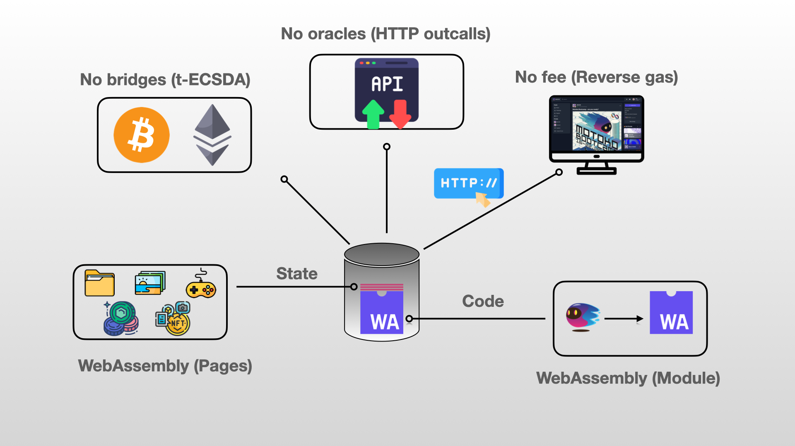

# Day 2️⃣

- Union type
- Intersection type


## Union type

## Intersection type

## 📚 Using modules & the **Base** library
Yesterday, we've only looked at operations that are built-in to the language. To perform more complex operations, we'll need to import and use modules, especially those from the [Base library](https://internetcomputer.org/docs/current/motoko/main/base/).

The Base library is a set of modules & functions that provide functions for commonly used types (such as `Bool`, `Nat`, `Int`, `Text` and more).

A module is a collection of code written by someone else that you can use in your own program. <br/>
We will explore different methods for importing modules and even creating our own modules, but for today we will focus on importing modules from the **Base** library.

The source code for this library is [available on Github](https://github.com/dfinity/motoko-base/) and is maintained by engineers from the DFINITY foundation and community members. 
<br/>
Each module has its own documentation page, where you can learn about the available functions. For example, here is the [documentation page for the Nat module](https://internetcomputer.org/docs/current/motoko/main/base/Nat).

<p align="center"> </p>

> The source code is meant to understand how a specific module was written, whereas the documentation is meant to understand how you can use a module.

There is a module for each type: 
- A module `Nat` corresponding to operations on `Nat`.
- A module `Int` corresponding to operations on `Int`.
- A module `Text` corresponding to operations on `Text`.
- A module `Char` corresponding to operations on `Char`.
- And way more..

Importing a module is done at the top of the file before the `actor` declaration.
```
import Nat "mo:base/Nat";
actor {
    public func convertToText(n : Nat) : async Text {
        return Nat.toText(n);
    };
};
```
## 🔎 Debug 
**Debug** is a module that provides utility functions for debugging and printing informations. 

`Debug.print()` will print text to the output stream (i.e your terminal).

```motoko
import Debug "mo:base/Debug";
actor {
    Debug.print("Hello!");
};
```
<p align="center"> </p>
<p align="center"> The text will be printed in the same tab that is running your replica. Make sure to check out the correct place!</p>

> Unfortunately, `print` can only be used locally. On the mainnet or when using Motoko Playground there is no concept of output stream so `Debug.print` has no effect.

`Debug.print()` only accepts a value of type `Text` as input. If you have any  object, you can use the `debug_show` command to automatically convert it to `Text`. 
```motoko
let array : [Nat] = [19, 8, 2, 5];
Debug.print(debug_show(array));
```
You can also use convertion functions
```motoko
import Nat "mo:base/Nat";
import Debug "mo:base/Debug";
actor {
    let n : Nat = 5;
    Debug.print(Nat.toText(n));
}
```
## 💬 Text 
In Motoko, strings can be written surrounded by double quotes `"`
```motoko
"Hello Motoko Bootcamp!"
```
The type for string is `Text` (pretty easy to remember).
```motoko
let welcomePhrase : Text = "Hello Motoko Bootcamp!";
```

We can use the concatenation operator `#` to join two `Text` together.
```motoko
let firstName : Text = "Motoko";
let surname : Text = "Bootcamp";
let completeName : Text = firstName # surname;
```

We can access the size of a `Text` by calling the `.size()` method.
```motoko
let name : Text = "Motoko";
let size = name.size()  // 6
```
## 🔤 Char
A value of type `Text` is actually composed of values from another type: `Char`. A `Text` is the concatenation of multiple characters. Characters are single-quote delimited `'`
```motoko
let character_1 : Char = 'c';
let character_2 : Char = '8';
let character_3 : Char = '∏';
```
`Char` are represented by their [Unicode code points](https://deliciousbrains.com/how-unicode-works/). We can use the `Char` module from the Base library to check the unicode value. 
```motoko
import Char "mo:base/Char";
import Debug "mo:base/Debug";
actor {
    let a : Char = 'a';
    Debug.print(debug_show(Char.toNat32(a)));   // 97
}
```
We can easily iterate over all the characters in a `Text`, by calling the `chars()` method. We can then use this iterator to create a `for` loop.
```motoko
import Debug "mo:base/Debug";
import Char "mo:base/Char";
actor {
    let name : Text = "Motoko";
    for (letter in name.chars()){
        Debug.print(Char.toText(letter));
    };
};
```
> Notice how when we iterate `letter` is a `Char` and we need to convert it back to `Text` to use `Debug.print`.

The `Char` module also contains a few functions that can be used to test properties of characters:
- `isDigit`
```motoko
Char.isDigit('9');  // true
```
- `isWhitespace`
```motoko
Char.isWhitespace('a'); // false
```
- `isLowercase`
```motoko
Char.isLowercase('c');  //  true
```
- `isUppercase`
```motoko
Char.isUppercase('D');  // true
```
- `isAlphabetic`
```motoko
Char.isAlphabetic('|'); // false
```
## Float
`Float` are numbers that have a decimal part.
```motoko
let pi = 3.14;
let e = 2.71;
```
If you want to use `Float` for whole numbers, you need to add the type descriptor otherwise they would automatically be casted to `Ìnt` or `Nat`. 
```motoko
let f : Float = 2;
let n = 2;  // Automatically casted to type Nat
```

`Float` are implemented on 64-bits folowing the [IEEE 754 representation](https://www.geeksforgeeks.org/ieee-standard-754-floating-point-numbers/). Due to the limited precision, operations may result in numerical errors.
```motoko
0.1 + 0.1 + 0.1 == 0.3 // => false
```
```motoko
1e16 + 1.0 != 1e16 // => false
```

`Float` supports all arithmetic operations and comparison seen before on `Nat`and `Int`.
## 👯 Tuples
Tuples are basic units that can encompass multiple elements. While the elements can vary in data type, once declared, the number and type of elements in a tuple cannot be altered. For instance, you could make a tuple that holds a student's name, age & favorite programming language.
```motoko
type Student = (Text, Nat, Text);
let me : Student  = ("Bob Smith", 25, "Motoko");
```
In more complex situations, we would create our own object with named fields, making it more readable. 

The empty tuple type `()` is called the `unit` type. It is usually used as return type for function that returns nothing. 
 
```motoko
public func print(t : Text) : async () {
    Debug.print(t);
};
```
## 🎨 Object & custom type
Objects are more readable than tuples since each field has a name. The  different fields are also each assigned a type which cannot be modified once declared.  
 Let's define an object called `student`, which contains 4 fields: 
 - name which is a `Text` indicating the name of the student.
 - age which is a `Nat` indicating the age of the student.
 - favoriteLanguage which is a `Text` indicating the favorite programming language of the student.
 - graduate which is a `Bool` indicating if the students has already graduated from the Motoko Bootcamp. 

```motoko
let student = {
    name = "John";
    age = 35;
    favoriteLanguage: "Motoko":
    graduate : true;
};
```
Similar to other variables in Motoko, objects can be mutable or immutable. The object we've just defined is immutable, once the fields have been assigned a value they cannot be modified. 

```motoko
let student = {
    name = "John";
    age = 35;
    favoriteLanguage: "Motoko":
    graduate : true;
};
student.age += 1;  
```
This code will throw an error `expected mutable assignment target`.

To create an object that can be modified, we must use the `var` keyword in the field definition. Let's modify the previous example so that only the student's age can be changed, while the other fields remain constant.
```motoko
let student = {
    name = "John";
    var age = 35;
    favoriteLanguage: "Motoko":
    graduate : true;
};
student.age += 1; 
```
Objects are often assigned types. In this case we need to create **custom type**.  Let's define a type called `Student` which corresponds the object we've previously created. 
```motoko
type Student = {
    name : Text;
    age : Nat;
    favoriteLanguage : Text;
    graduate : Bool;
};
```
## 🏭 Classes
Classes are factories for constructing object. A class allows us to define a type that can take on parameters and functions. Functions that are attached on the object are usually called **methods**.
```motoko
class Student(_name : Text, _age : Nat, _score : Nat) {
    public let name : Text = _name;
    public var age : Nat = _age;
    public var score : Nat = _score;
    public func study() {
        score +=1;
    };
};
```
Once the `Class` is defined we can easily create new instances by providing parameters.
```motoko
let John : Student = Student("John Doe", 25, 0);
``` 

`Class` is just a keyword that provides syntaxic sugar - we could also write the following: 
```motoko
type Student = {
    name : Text;
    var age : Nat;
    var score : Nat;
};

func Student(_name : Text, _age : Nat, _score : Nat) : Student = object {
    public let name : Text = _name;
    public var age : Nat = _age;
    public var score : Nat = _score;
    public func study() {
        score +=1;
    };
};
```

## 🔮 Structural typing
**Typing** refers to the way in which data types are defined and checked in a programming language. There are two main approaches to typing: nominal typing and structural typing.

In Motoko, the question of whether two types (or classes) are equal is based on their structure, not their names! This property is called **structural typing**. <br/>

What does it mean exactly? Let's imagine that we define two types.

```motoko
class Student(_name : Text,  _score : Nat) {
    public let name : Text = _name;
    public var score : Nat = _score;
};  

class Player (_name : Text,  _score : Nat) {
    public let name : Text = _name;
    public var score : Nat = _score;
}
```
Those two types are considered equal from the point of view of the language. 
Indeed, we can write the following, and it's correct! 
```motoko
let John : Student = Player("John Doe", 0);
let Emma : Player = Student("Emma Smith", 0);
```
## 🌈 Variants
Variants are extremly used and helpful. <br/>

A variant allows you to create a type that contains different cases. A value from the variant type represents one value that is exactly one of the given cases, or tags. Let's define a variant type for a `Vehicle` which can be either a car, a moto or a plane.

```motoko
type Vehicle = {
    #Car;
    #Moto;
    #Plane;
};
```
Each tag can be associated it's own custom type. 
```motoko
type Car = { make : Text; model : Text; year : Nat; color: Text };
type Moto = { make : Text; model : Text; year : Nat; type : Text };
type Plane = { make : Text; model : Text; year : Nat; seats : Nat };
}

type Vehicle = {
    #Car : Car;
    #Moto : Moto;
    #Plane : Plane;
};
```

Variants are often used with `switch/case`, which allows to perform control flow on a variant object. 
```motoko
public func start(v : Vehicle) : async Text {
    switch(v){
        case(#Car(car)){
            // We can access the car object. For instance we can access the make field by using car.make
            let make = car.age;
            return("Vroom 🏎️");
        };
        case(#Moto(m)){
            // We can give the object any name that is convenient. In this case we can access the type by using m.type.
            let type = m.type;
              return("Roar 🏍️");
        };
        case(#Plane(x)){
            // Here we go again.. we can access the number of seats by using x.seats
            let seats = x.seats;
             return("Whoosh 🛫");
        };
    };
};
```

## 🫙 Optional type
In Motoko `null` is a special value that represents the absence of result. The value `null` is of type `Null` (and the type `Null` only contains only the `null` value). <br/> 
An optional type, is a type that can either hold a value or "nothing". It is a way to represent the possibility that a value may be absent. We use the `?` symbol to indicate an optional type.
<br/>

For instance, if we have a value of type: `?Text` (optional Text) it means that the value can either be:
- A value of type `Text`.
- The `null` value.

An optional type can be: `?Nat`, `?Bool`, `?Char` or any other existing type.
Optional types are often used with the `switch/case` pattern. This pattern allows you to handle an optional value and execute different parts of your code depending on whether the input value is `null` or not. This allows for more elegant and safer code as it allows you to handle the case where the input is null and avoid any unexpected behavior.

```motoko
public func handleOptionalNat(n : ?Nat) : async Nat {
    switch(n){
        case(null){
            return 0
        };
        case(? some){
            return some
        };
    };
};
```

A module from the base library called [Option](https://internetcomputer.org/docs/current/developer-docs/build/cdks/motoko-dfinity/base/Option) provide utilities functions to perform operations on optional values.

[TODO: ADD IMAGE] 
<br/>
For instance, you can use `Option.get()` to unwrap an optional value. (i.e take a `?Nat` as input and return a `Nat`)
- If you provide a `Nat` as input it will return the same value.
- If you provide `null` it will return the default value - which we can set to 0. <br/>
We can use this method to rewrite `handleOptionalNat()` 
```motoko
import Option "mo:base/Option";
actor {
    public func handleOptionalNat(n : ?Nat) : async Nat {
        Option.get(n, 0);
    };
}
```


# 🧩 What is DAO? Overview of the NNS

> During this week you will have the opportunity to build a prototype for a Decentralized Autonomous Organization (DAO). This is why we want to answer an important question: **What is a DAO?**

## 🏛️ Decentralized Autonomous Organization: a new model of governance?

<p align="center">  </p>

Throughout history, humans have find different creative ways to organize in social groups and structures. They have done so different reasons such as safety, support, social identity, work, power or even economic. A few common groups include: family unit, tribes, clans, states, guilds, secrect societies, political parties...

With the advent of the Internet, social networks, cryptocurriencies & smart contracts many believe that a new type of organization is about to start a new chapter of human history: **DAO**. 

A Decentralized Autonomous Organization (DAO) is a digital organization that is composed of members living all around the world, and is governend and organized by smart contracts. 

Because smart contracts execute automatically, are decentralized, transparent, can't be censored or modified by any individual the same applies to **DAOs** in the sense that they are not controlled by any single individual or entity, they rather operate based on the collective decision-making of their members.

A few usecases for DAOs include:

- **Decentralized venture capital**: DAOs can be used to enable decentralized venture capital funds, in which members can propose and vote on investments in projects. [The DAO](https://en.wikipedia.org/wiki/The_DAO_(organization)) was one of the first DAOs to be created and was designed to be a decentralized venture capital fund, although it was controversial and ultimately failed due to a hack.
 
- **Decision-making**: DAOs can be used to enable members to make decisions about the direction of a project or organization. For example, MakerDAO is a decentralized finance (DeFi) platform that is built on the Ethereum blockchain and is governed by a DAO, in which members can vote on proposals to change the parameters of the MakerDAO system, such as the interest rates on loans.

- [TODO: ADD MORE]

## 🙁 Limitations of DAOs
As we've said DAOs are formed through smart contracts. However, smart-contracts are pretty limited:
- They can't store any meaningful amount of data (photos, videos, files...). [The cost of storing 1GB of data in the Ethereum blockchain has been estimated at around $5.5M](https://steemit.com/ethereum/@suryanshkumr/you-need-usd5-5m-to-save-1gb-data-in-ethereum-blockchain-d)
- It is not possible to interact with a smart contracts directly from a browser. A wallet needs to be installed and acts as relay.
- Smart contracts rely on oracles to gather information from the external world and facilitate communication with it, as they are unable to interact with anything outside of the blockchain on their own. 
- Smart contracts are limited in term of computational  power they have access to. 

Those technical limitations results in concrete actions that a DAO would be unable to do: 
- 🌳 **Interact with the physical world**: DAOs are limited to the digital world and cannot interact with the physical world. A DAO could not plant a tree, turn on a light switch, or deliver a physical letter.
- 📲 **Access external data sources**: For example, a DAO could not retrieve the current temperature from a weather website, or the current stock price from a financial website.
- 🔮 **Use advanced computational power**: For example, a DAO could not run simulations to predict the outcome of a complex system, such as the spread of a pandemic or the performance of a financial portfolio.
- 🗂️ **Handle large amounts of data**: For example, a DAO could not store and process the complete medical records of millions of patients.

Those important limitations are preventing DAOs to have a meaningful impact in the world. 

## 🚀 From smart-contracts to canisters
Imagine that smart-contracts could:
- Store unlimited amount of data & run any computation.
- Be accessible directly from any browser.
- Communicate with the external world trough HTTP requests.
- Create and sign transactions on any blockchain (Bitcoin, Ethereum...).
- Being upgradable to constantly add new features & fix potential bugs.
- Remove fees and enable anyone to interact with them. 

Does it sound interesting? Welcome to the fabulous world of **canisters**! <br/>

<p align="center"> </p>
<p align="center"> Imagine what DAOs will be able to achieve using canisters!</p>
By using canisters, DAOs are now able to control entire web applications.

This means that future web services (social network, search engine, games, mail client, messaging application...) can run entirely on a set of canisters, where the governance of those canisters is ensured through a tokenized public governance canister.  <br/>

<p align="center">  </p>

This concept is called Open Internet Services. The aim is to end the current monopoly of BigTech companies (Facebook, Google, Apple, Twitter, Microsoft, Tiktok... ) that profits from the centralized aspect of the Internet. By aligning incentivizes between investors, users, and developers, those services are expected to operate in a more transparent, privacy-friendly and cooperative manner.

<p align="center">  </p>


> **A prediction?** <br/> Open Internet Services are powerful and won't stop with social networks or messaging apps. They are here to revolutionize the way we work and live together. With unprecedented scalability of collaborative work enabled by the combined power of DAOs and OIS, the sky's the limit! Imagine the positive impact on humanity with projects like environmental conservation, medical research, and education all being amplified by this new level of coordination and collaboration. And this is just the tip of the iceberg, as this new technology could open the door to even more innovative solutions to some of the world's most pressing problems. This is an opportunity to make real progress and change the world in ways we never thought possible before. **Get ready, the future is here!**