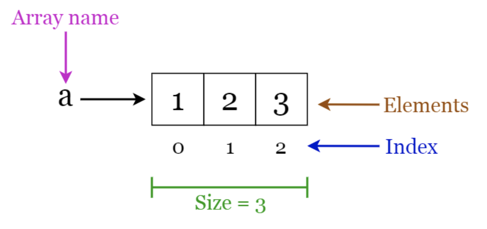
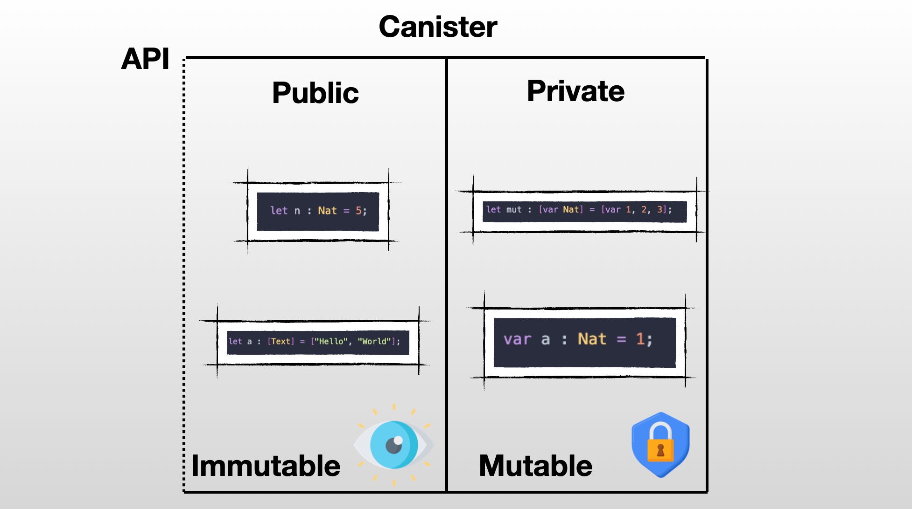
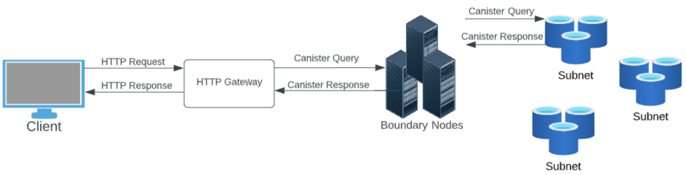
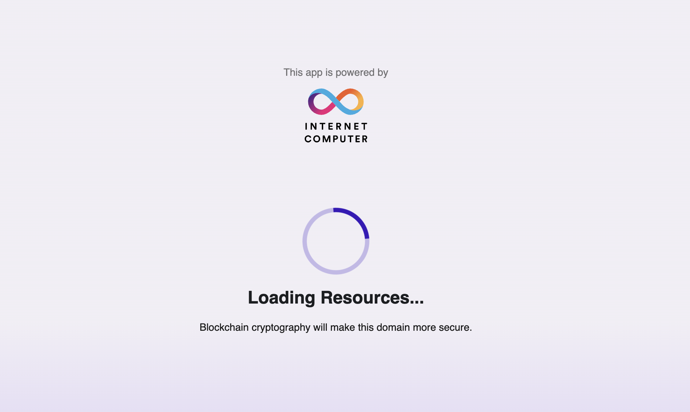
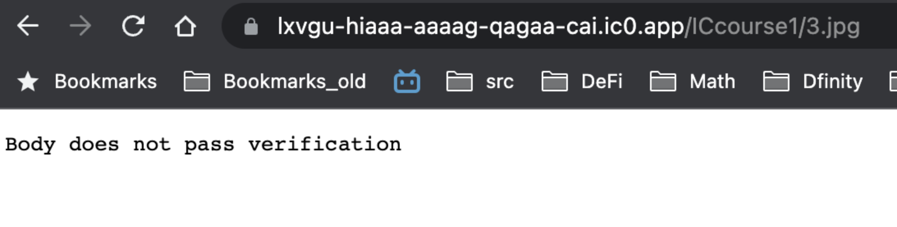
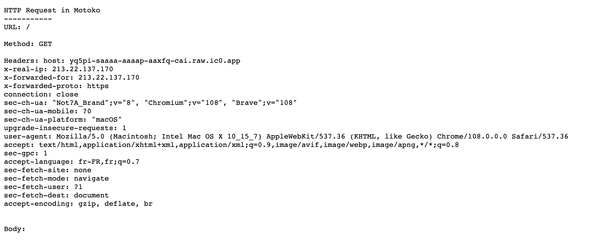
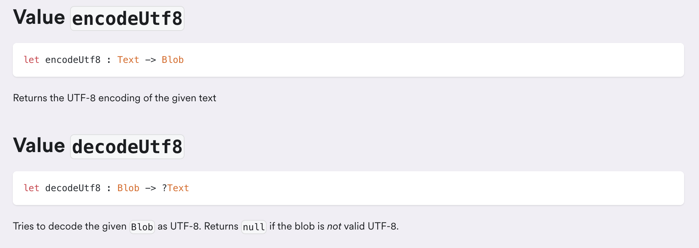

# Day 3️⃣
- HTTP Requests

## 🗃️ Arrays
In Motoko, an array of type `Array` is a group of **similar** elements that are stored together. To create an array, one must specify the types of elements that the array will contain. 
For instance, to create an array that will hold `Nat`.
```motoko
let ages : [Nat] = [16, 32, 25, 8, 89];
```
An array that will hold values of type `Text`.
```motoko
let words : [Text] = ["Motoko", "is", "the", "best", "language"];
```
Contrary to other programming languages which might be more flexible in that regard, in Motoko we can't mix elements of different types in the same array. The following code will throw an error: `literal of type Text does not have expected type Nat`. 
```motoko
let array : [Nat] = [14, 16, 32, 25, "Motoko"];
```

<p align="center"> </p>

To access a specific element within an array, we use its index. Keep in mind that arrays in Motoko are zero-indexed, which means that the first element is at position 0, the second element is at position 1, and so on. For example, to access the first element of an array named `myArray`, we would use `myArray[0]`, and to access the second element, we would use `myArray[1]`.
```motoko
let myArray : [Nat] = [23, 16, 32, 25];
let a = myArray[0]  // 23
let b = myArray[3]  // 25
```
We can access the size of an array using the `.size()` method.

```motoko
let names : [Text] = ["Emma Smith", "Olivia Johnson", "Ava Brown", "Isabella Davis"];
let size = names.size();    // 4
```

To loop over an array we can use the `.vals()` iterator. Here is an example that would gave us the sum of an array.
```motoko
actor {
    let array : [Nat] = [1, 2, 3, 4, 5];
    var sum : Nat = 0;

    public func somme_array() : async Nat {
        for (value in array.vals()){
          sum := sum + value;
        };
       return sum; 
    };
};
```

In Motoko, arrays have a fixed size that is determined when the array is created. This means that the size cannot be increased later on. To add a new element to an array, a new array must be created and all of the existing elements must be transferred to the new array manually. This makes `Array` not really adapted for datastructures that needs be constantly updated. 

Concatenating two arrays to an `Array` can be done using `Array.append()` - a function from the [Array](https://internetcomputer.org/docs/current/motoko/main/base/Array) module. 
```motoko
let array1 = [1, 2, 3];
let array2 = [4, 5, 6];
Array.append<Nat>(array1, array2) // [1, 2, 3, 4, 5, 6];
```
However, this function is **depreceated**. It is recommended to avoid it in production code. That's because as we've said before it is impossible to simply add elements to an array. Under the hood, `Array.append()` will create a new array and copy the values of the two existing arrays which is not efficient. 
## 🪨 Immutable or Mutable?
Arrays are also immutable by default, just like variables declared with "**let**". This means that the values inside an array can be read but not modified. 

> Accessing elements within an array is quick and efficient due to the immutability of arrays. Since the size of an array is established at the time of creation and the memory locations for all elements are predetermined, accessing elements is straightforward. The memory allocation for an array is determined by its fixed size, and the position of the first element is known, making it possible to calculate the location of all other elements. It is not necessary to have a deep understanding of computer memory management for this lesson, but it's worth mentioning that accessing elements in arrays is efficient, but adding new elements is not.

The following code would throw an error:
```motoko
let dates : [Nat] = [1, 3, 6];
dates[0] := 5;
```
> **Error in file Main.mo:2:0 expected mutable assignment target**

It is possible to create mutable arrays but just like variables and objects you have to use the keyword `var`. 
```motoko
let mutable_dates : [var Nat] = [var 1, 3, 6];
```
Mutable arrays permits updates of the elements inside the array.
```motoko
mutable_dates[0] := 5; //[5, 3, 6];
mutable_dates[2] := 1; //[5, 3, 1];
```
Mutable and immutable arrays **do not have the same type**. Which means that it is not possible to use a mutable array of type `[var X]` in places that expect an immutable one of type `[X]` and the same for the opposite.
## 🤫 Mutable state
In Motoko, actors are restricted from sharing a mutable state. Mutable data must always be kept private and can never be shared remotely. This rule has been designed to simplify your programming experience. It prevents multiple actors from simultaneously modifying a shared variable without knowledge of the other actors' actions. Otherwise this would cause confusion and make programming with actors way more difficult.

<p align="center"> </p>

In practice this means that sharing a mutable array is not possible.
```motoko
actor {
    let mut : [var Nat] = [var 1, 5, 3];

    public func getArray() : async [var Nat] {
        return mut;
    };
};
```
The previous code would result in the following error: `shared function has non-shared return type [var Nat] type [var Nat] is or contains non-shared type var Nat`.

If one wants to share a mutable array with the outside world (another actor or user), one has to converts it to an immutable array before sharing it. This can be done with the `Array.freeze()` function. We can use it to correct the previous code block.
```motoko
import Array "mo:base/Array";
actor {
    let mut : [var Nat] = [var 1, 5, 3];

    public func getArray() : async [Nat] {
        let immutable = Array.freeze<Nat>(mut);
        return immutable;
    };
};
```
## 🥞 Buffer
A more adapted structure to dynamically add new elements is the type `Buffer`. 
A `Buffer` can be instantiated using the [Buffer](https://internetcomputer.org/docs/current/motoko/main/base/Buffer) library. 
One needs to provide the types of elements stored inside and the initial capacity. 
The initial capacity represents the length of the underyling array that backs this list. In most cases, you will not have to worry about the `capacity` since the Buffer will automatically grow or resize the underlying array that holds the elements.
```motoko
import Buffer "mo:base/Buffer";
actor {
    let b = Buffer.Buffer<Nat>(2);
}
```
In this case, the types of elements in the buffer is `Nat` and the initial capacity of the buffer is `2`. 

To add an element use the `.add()` method.
```motoko
b.add(0);   // add 0 to buffer
b.add(10);   // add 10 to buffer
b.add(100)    // causes underlying arrray to increase in capacity since the capacity was set to 2
```
To get the number of elements in the buffer use the `.size()` method. The `size` is different than the capacity we've mentionned earlier since it represents the number of elements that are actually stored in the buffer.
```motoko
let b = Buffer.Buffer<Nat>(2);
b.add(0);   
b.add(10);   
b.add(100);  
b.size();   // 3
```
To access an elements in the buffer, use the `.get()` method and provides the index. 
```motoko
let b = Buffer.Buffer<Nat>(2);
b.add(0);   
b.add(10);   
b.add(100);  
b.get(2);   // 10
```
Traps if `index` >= `size`. Indexing is zero-based like with `Array`.
A buffer can easily be converted to an array using the `toArray()` function from the [Buffer library](https://internetcomputer.org/docs/current/motoko/main/base/Buffer#function-toarray-1).


```motoko
let b = Buffer.Buffer<Nat>(2);
b.add(0);   
b.add(10);   
Buffer.toArray<Nat>(b); // [0, 10];
```

## 👤 Generic Type
A generic type, usually written as `T`, allows you to write functions and code that can adapt to different types. When we talk about `T`, it refers to **whatever type you want**. This means that you can create a single function or class that can handle multiple types of inputs or data, without having to write separate code for each type.

Let's imagine that we have a task at hand - to determine if the size of an array is even or not. We're going to write a function called `isArrayEven` that takes an array as an input and returns a `Bool` value indicating whether the size of that array is even or not.
```motoko
public func isArrayEven(array : [Nat]) : async Bool {
    let size = array.size();
    if(size % 2 == 0){
        return true;
    } else {
        return false;
    };
};
```
This function works as intended, but is limited to arrays filled with `Nat`. So, what if we want to check the size of an array filled with `Text` or `Int`? <br>
One approach would be to create a separate function for each possible type: 
- `isArrayEvenNat`
- `isArrayEvenText`
- `isArrayEvenInt` 

As you can imagine, this quickly becomes hard to manage and maintain. A better solution is to utilize the power of generics. With generics, we can write a single function that works for any type of array. It's a more elegant and efficient way to solve the problem. So, let's embrace our new friend - generics - and make our code more dynamic and flexible!
```motoko
func isArrayEven<T>(array : [T]) : Bool {
    let size = array.size();
    if(size % 2 == 0){
        return true;
    } else {
        return false;
    };
};
```
Notice `<T>` following the name of the function. It means that this function now depends on the type of `T`. We need to specify the type of `T` when we want to use the function.
```motoko
let array : [Nat] = [1,2,3,4];
let bool : Boolean = isArrayEvent<Nat>(array); // Replace T with the actual type when you use the function. 
```

We've  already used generics when playing with `Buffer` & `Array` without talking about it. 
- The type `Buffer<T>` is a generic class and we need to provide a type when creating a new buffer.
    ```motoko
    let b = Buffer.Buffer<Nat>(2);
    ```

- `Array.append<T>` is a generic function and we need to provide the type of the elements of the arrays we are concatening.
    ```motoko
    let array1 = [1, 2, 3];
    let array2 = [4, 5, 6];
    Array.append<Nat>(array1, array2) // [1, 2, 3, 4, 5, 6];
    ```

## 🚥 Result type
The `Result` type is extremly useful in Motoko to handle errors, it is defined as a variant type. 
```motoko
type Result<Ok, Err> = {#ok : Ok; #err : Err}
```
It can be used by importing the [Result library](https://internetcomputer.org/docs/current/motoko/main/base/Result). 
The generics `Ok` and `Err` can be used to customize the types you want to return to return in case of success or error. 
Let's imagine the following situation: we want to create a `Result` type that indicates whether a student graduate or not. 
- If the student graduate we return the score of the student.
- If the student fails we return a variant that indicate the reason for failure (score too low, absent, cheating...).

```motoko
type Score = Nat; // The score of a student. 
type ExamFailed = {
    #ScoreTooLow : Nat;     //  The score of the student. 
    #Absent;    //  One reason for failing an exam.
    #Cheated;   //  Another one.
};
type ExamResult = Result.Result<Score, ExamFailed>;
```
It is common to use a variant type for `Err`. It enables a more granular control over the different types of errors and facilitate pattern matching.
```motoko
func sendMessageToStudent(result : ExamResult) : Text {
    switch(result) {
        case(#ok(score)){
            return ("Congrats 🎉 - you have graduated with a score of : " # Nat.toText(score));
        };
        case(#err(failure)){
            switch(failure){
                (#ScoreTooLow(score)){
                    return ("Unfortunately your score is below requirements. Next time you'll graduate! You had a score of : " # Nat.toText(score));};
                };
                case(#Absent){
                    return ("You were absent at the exam. Please schedule another time.");
                };
                case(#Cheated){
                    return("Cheating is a short-term gain that leads to long-term pain");
                };
            };
        };
    };
};
```
`Result` is used for errors that are generally expected in your program and where you want to return something. In case of an unexpected and unrecoverable error you should `trap` your code. 
The best way to do so if to use the `Debug.trap()` method from the [Debug library](https://internetcomputer.org/docs/current/motoko/main/base/Debug) which allows you to pass an error message along the `trap`.
```motoko
func trap(errorMessage : Text) : None
```
Trapping can also be caused by `assert(false)`. Assertions allow you to conditionally trap when some Boolean test fails to hold, but continue execution otherwise.
```motoko
let n = 38;
assert n % 2 == 0; // traps when n not even
assert(false);  // always traps
```

## 🌍 HTTP request: accessing a canister through a browser.
In this module, we will cover how canisters can be accessed through HTTP requests. This is a separate topic from **HTTP Outcalls**:

- HTTP Request: Canisters can handle incoming requests and serve web pages.
- HTTP Outcalls: Canisters can send requests and communicate with the Web 2.0 world. This can be used for various use cases, such as querying an exchange for token prices, getting the latest weather information, and sending notifications to us


Whenever you [access a canister](https://wujxq-qqaaa-aaaaj-qazca-cai.raw.ic0.app/) through your browser there are a few steps involved. Let's go through all of them.
You will notice that URLs on the Internet Computer are of the following form: <CANISTER_ID>.ic0.app The .ic0.app indicates that you are reaching out to [boundary nodes]().

### What are boundary nodes?
Canisters are hosted and executed by nodes that participate in the IC consensus However, those nodes are not directly accessible by end users.
To protect the consensus nodes & improve performance there is a layer of boundary nodes which serve different useful purposes:

- Translate the HTTP request of the user's browser to canister call. This part is called the HTTP Gateway protocol. When canisters send their response the gateway will convert it back to an HTTP request.
- Route the calls to the correct subnet running the canister. To properly route those calls the boundary nodes have to keep track of the entire configuration of the Internet Computer:
    - List of subnets.
    - List of nodes and which subnet they belong to.
    - The canisters run by each subnet.
- Load balancing among the subnet's replica nodes (i.e if a replica is lagging behind and has already a lot of work on its plate - boundary nodes will send the request to another replica).
- Protect subnets from DDoS attacks.

<p align="center">  </p>

> Currently, boundary nodes are run by the DFINITY Foundation. However, the objective ([as part of the roadmap](https://forum.dfinity.org/t/boundary-node-roadmap/15562)) is to have anyone able to set up and run a boundary nodes. This will make interaction with the Internet Computer more reactive for end users and this will make the platform more robust to censorship.

### Asset canister

To serve web content on the Internet Computer, a canister should have a method that can handle an `http_request`, which includes the URL, HTTP method, and headers, and produce an HTTP response, consisting of a status, headers, and body. There are two ways to go about that:

- Implement the http_request method and all associated logic yourself.  
- Use the provided **asset** canister: this is a special canister whose code has been already implemented by DFINITY. You need to specify the type of this canister in `dfx.json` & add the source folder of your web app. Once the asset canister is deployed on the Internet Computer the website can be accessed at `http://<canister id>.ic0.app` and `http://<canister id>.raw.ic0.app`. The frontend canister that is shipped when you deploy a project with `dfx new <project>` is an asset canister (as you can confirm by looking at `dfx.json`).

> You can access [the source code for this canister written in Rust](https://github.com/dfinity/sdk/tree/master/src/canisters/frontend/ic-frontend-canister) under the [DFINITY organization](https://github.com/dfinity).  

### What is the difference: ic0.app vs raw.ic0.app?
As we've said earlier there are two ways to access a canister:
- raw.ic0.app: the raw URL raw URL will simply return the request as it is so serves the asset files (HTML, CSS, Javascript).
- ic0.app: uses a service worker to verify the content served by the boundary node. The service worker is loaded and then handles requests, verifying the signature of the assets served by the canister using the public key on the Internet Computer.

<p align="center">  </p>
<p align="center"> Loading the service worker...</p>

When accessing a webpage, speed is a key factor. This is why we use query calls to handle http_request. However, it's important to note that query calls do not go through a consensus process and cannot create signatures. To address this issue, we use certified variables. This means that the content must be certified prior to the call being made. In some cases, this certification process may not be possible and if you are accessing a website under ic0.app, you may encounter an error page as a result.

<p align="center">  </p>

<p align="center" > In that case you should access under raw.ic0.app to avoid the issue.</p>

> It's worth noting that the service worker received when accessing ic0.app could potentially be altered by the boundary node to certify incorrect responses. This is a potential issue since most users won't take the time to verify the authenticity of the service worker. To mitigate this risk, it would be ideal to have the public key of the Internet Computer directly integrated into the hardware or browser! This would provide an expectional level of security and be a convenient option, giving users peace of mind and the confidence to trust the authenticity of the content they are accessing!"

### 🤙 Contacting the canister
Once the boundary node has received the request. It will encode it into Candid and automatically call the http_request method of the canister. reachable by browsers, you need to implement an `http_request` method as part of the public interface of your  actor. <br/>

This is the minimum code needed to return a simple page that prints **Hello world**.
```motoko 
import Text "mo:base/Text";
import Http "http";
actor {
    public type HttpRequest = Http.HttpRequest;
    public type HttpResponse = Http.HttpResponse;

    public query func http_request(req : HttpRequest) : async HttpResponse {
        return({
            body = Text.encodeUtf8("Hello World");
            headers = [];
            status_code = 200;
            streaming_strategy = null;
        });
    };
};
```

## 🧩 Module 
You may have noticed the `HttpRequest` and `HttpResponse` types in the Motoko code earlier. These types are defined in an external file called `http.mo`. So far we've only seen how to import modules from the Base library - let's move to the next level and see how we can create and import our own modules!

> It is a recommended practice to create custom types and their associated methods in a separate file for organization, clarity, and reusability. This is want we are going to do for the HTTP related types.

Here is the content of the `HTTP` module, the file name is `http.mo`.
```motoko
module Http {
    public type HeaderField = (Text, Text);

    public type HttpRequest = {
        body: Blob;
        headers: [HeaderField];
        method: Text;
        url: Text;
    };

    public type HttpResponse = {
        body: Blob;
        headers: [HeaderField];
        status_code: Nat16;
        streaming_strategy: ?StreamingStrategy;
    };

    public type StreamingStrategy = {
        #Callback: {
            callback : StreamingCallback;
            token    : StreamingCallbackToken;
        };
    };

    public type StreamingCallback = query (StreamingCallbackToken) -> async (StreamingCallbackResponse);

    public type StreamingCallbackToken =  {
        content_encoding : Text;
        index            : Nat;
        key              : Text;
    };

    public type StreamingCallbackResponse = {
        body  : Blob;
        token : ?StreamingCallbackToken;
    };
}
```

Instead of our usual `main.mo` file, which typically starts with the `actor`keyword.
```motoko
actor {

}
```
It has been replaced by the `module` keyword.
```motoko
module {

}
```
This indicates that the `http.mo` will not be used to declare an actor with a public interface but instead a module with a public interface that will be imported into the main file.

> The concept of a `public` field in a module changes its meaning from what we've been used to. Public methods or variables in a module can be accessed by importing the file into the main module, `main.mo`, but it does not mean that it can directly be accessed by other canisters or users.

We can also add a name to help identify the module. It is possible to have multiple modules with different names in the same file - though it is not recommended to do so to keep things clear and simple.

```motoko
module Http {

}
```

### HttpRequest
Here is how the `HttpRequest` type is defined in Motoko.
```motoko
module Http {
    public type HeaderField = (Text, Text);

    public type HttpRequest = {
        body: Blob;
        headers: [HeaderField];
        method: Text;
        url: Text;
    };
}
```
To help illustrate the concept, I have deployed a canister that returns a webpage containing all the information contained in the HttpRequest object it receives <br/> 
You can access it [here](https://yq5pi-saaaa-aaaap-aaxfq-cai.raw.ic0.app/).<br/>


<p align="center">  </p>
<p align="center"> Different information will show up based on your browser, language & machine.</p>


As you can see when we access the following URL: 
https://yq5pi-saaaa-aaaap-aaxfq-cai.raw.ic0.app/

- The **URL** is /.
- The **method** is GET.
- The **headers** will depend on your configuration (IP address, browser, os, language...).
- The **body** is empty. 

```motoko
let request : HttpRequest = {
    body = null;
    headers = [("User-Agent", "Mozilla/5.0 (Windows NT 10.0; Win64; x64; rv:144.0) Gecko/20100101 Firefox/144.0")];
    method = "GET";
    url="/";
}
```

> The URL appears different because the boundary node removes unnecessary parts and directs the request to the canister, making the URL seen by the canister /. The original URL accessed by the client is https://yq5pi-saaaa-aaaap-aaxfq-cai.raw.ic0.app/.
### HttpResponse
Here is how the `HttpResponse` type is defined in Motoko.

```motoko
public type HttpResponse = {
    status_code: Nat16;
    headers: [HeaderField];
    body: Blob;
    streaming_strategy: ?StreamingStrategy;
};
```
- The [status code](https://developer.mozilla.org/en-US/docs/Web/HTTP/Status) is a three-digits number returned to indicate the outcome of the request and the status of the response. The first digit defines the category of the response:
    - 2xx indicates a successful response.
    - 4xx indicates a client error.
    - 5xx indicates a server error.
    -  few commons status codes are:
        - 200: OK.
        - 404: Not found.
        - 500: Internal Server Error.
    > Since the status code is always a three-digits number, we can use Nat16 which is a type of Nat that have a limited range of values.  Nat16 is stored on 16 bits so the range of values that can be represented is 0 to 2^16 - 1. The main point of using Nat16 instead of Nat is to save some memory space. 

- The `headers` field is the same concept we've seen earlier for `HttpRequest`.

- The `body` is encoded as [UTF-8](https://www.freecodecamp.org/news/what-is-utf-8-character-encoding/). You can encode `Text` in Motoko using the [Text module](https://internetcomputer.org/docs/current/developer-docs/build/cdks/motoko-dfinity/base/Text).
    <p align="center">  </p>

- Streaming strategy is a field for handling HTTP responses in a streaming manner, with the ability to callback for more data using the defined callback function. It is defined as follows:
    ```motoko
    public type StreamingStrategy = {
            #Callback: {
                callback : StreamingCallback;
                token    : StreamingCallbackToken;
            };
        };
        public type StreamingCallback = query (StreamingCallbackToken) -> async (StreamingCallbackResponse);

        public type StreamingCallbackToken =  {
            content_encoding : Text;
            index            : Nat;
            key              : Text;
        };

        public type StreamingCallbackResponse = {
            body  : Blob;
            token : ?StreamingCallbackToken;
        };
    ```
Some explanations:
- **StreamingStrategy** is an object type that has a single property, callback, which is an object that contains a callback function and a token.

- The **StreamingCallback** function is called in a loop, passing in a **StreamingCallbackToken** each time. The response from the callback includes a body and an optional new token, which is passed to the next iteration of the loop. The loop continues until the callback returns a response without a token!  <br/>

This is extremely useful because some pages or files are too large to be processed into a single message, and therefore, the use of StreamingStrategy is required.
