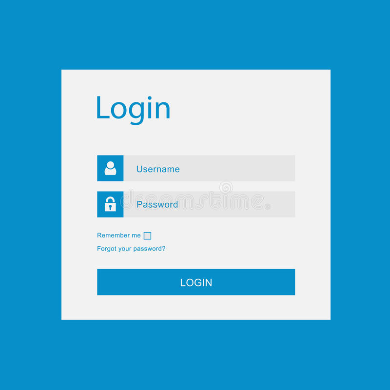

# Day 4️⃣

- Stable memory, stable variables & upgrades.
- DataStructures: HashMap & TrieMap.

## 👦 Identity 
### Username & passwords.
Identity is at the core of our digital lives. In the rapidly evolving world of the internet, it has become more important than ever to have secure and trustworthy methods of accessing our personal accounts and spaces. <br/>
For years, the traditional way of logging into websites has been with passwords & usernames. 

<p align="center"> </p>
<p align="center"> You are probably familiar with that type of interface.</p>

To create effective and secure passwords, one should:

- Select a long and randomly generated password.
- Avoid using the same password across multiple websites.

However, even when respecting basic security rules, this method of login has fundamental issues:

1. The server that grants authentication must store the username and password combination to verify the login and grant access. Although the password is often stored as a  hash, data breaches and leaks are still common.

2. Remembering and keeping track of passwords is a challenge, as most people have multiple accounts on various platforms, making it difficult to recall all of them. This is why the use of password managers and logging in through big tech companies (Apple, Facebook, Google, Microsoft) has become more prevalent.

3. Using passwords on a decentralized infrastucture like the Internet Computer is a bad idea. We are evolving in a world where we assume that some nodes can be malicious. If we need to send the password to all nodes, then it might leak at this point. 
### Login with Big Tech
As a result, the use of password managers and logging in through big tech companies like Apple, Facebook, Google, or Microsoft has become more prevalent. However, this method of login has its drawbacks as well. It requires people to trust these big tech companies with their personal information and access to other websites.

[TODO : ADD LOGIN WITH BIG TECH ]

With the increasing number of information we put online, do we really want to trust a handful of private companies? 
### Digital signatures 
Digital signatures are a more secure alternative to traditional username and password authentication. Digital signatures use a cryptographic technique to verify the authenticity of a message or document, ensuring that it has not been tampered with and that it comes from a verified sender. They are widely used in electronic transactions, such as online banking and e-commerce, as they provide a higher level of security and protection against fraud.

As the Internet Computer is built on a lot of cryptography, you won't be surprised to learn that they are used as a authentication mechanism for messages.
A digital signature scheme relies on 3 algorithms: 

1. **Key generation**: This algorithm is used to generate a public key and a private key. The public key is used to verify the digital signature, while the private key is used to create the digital signature.

2. **Signature**: This algorithm is used to create the digital signature using the private key. It applies a mathematical formula to the data that needs to be signed and the private key to generate a unique digital signature.

3. **Verification**: This algorithm is used to verify the digital signature using the public key. It applies a mathematical formula to the signed data, the digital signature, and the public key. If the output of the formula matches the original data, the digital signature is considered valid and the data is considered authentic.

<p align="center"> </p>

Of course, digital signatures have been already used intensively in the world of crypto! Everyone should know the famous saying: [Not your keys not your crypto](https://www.ledger.com/academy/not-your-keys-not-your-coins-why-it-matters). 
Users owning and mangaging their keys is great for security & decentralization, however it's not that easy. <br/> The main problem is keeping them secure & accessible.

<p align="center"> </p>
<p align="center"> If you loose your keys, there is no backup! </p>

If we want to manage our entire digital identities using cryptographic keys while onboarding millions of people into Web3, it seems that there is a challenging project to solve here! How do we keep the benefits of digital signatures while making it easier to use for everyone? 

### Web Authentication
[WebAuthentication](https://webauthn.guide/), also known as WebAuth, is a web standard that attempts to solve the issues raised earlier and standardize logins using public-key cryptography. 


- When a user first register to a WebAuthn-enabled service: 
    1. A key pair is generated for you. 
    2. The private key is stored securely on your device.
    3. The public key is sent to the service and associate it with the user's account.


[TODO : ADD ILLUSTRATION]


- When the same user wants to login again:
    1. A challenge is generated by the service.
    2. The device attemps to verify your identity through authentication factors (FaceID, TouchID, YubiKey, Windows Hello...)
    3. If the verification is correct, the device will sign the challenge and send it back to the service. 
    4. If the signature is correct, the service will grant access.

[TODO : ADD ILLUSTRATION]

The device usually integrates a secure chip that stores the private key. Those chips are designed to **never leak the private key**, they are only able to create signature when requested. 

WebAuthentication is both secure & convenient.

### Message on the Internet Computer.
As we mentionned on  day 1, all requests sent to the Internet Computer are passed through messages. Those messages are authenticated. 

[TODO : ADD ILLUSTRATION]

> There is an identity which is called the **Anonymous** identity, and allows communication with the Internet Computer in a completely anonymous manner.

A message contains the following information:
- ID of the target canister.
- Function called on this canister.
- Arguments provided for this functions. 

But more importantly, the message contains a signature! We can use this signature to verify the identity of the caller. 
### Delegations
With WebAuthentication, whenever the user creates a signature his identity will be verified through the authentication factors that've mentionned before, usually asking the user for confirmation. 
Let's imagine that our user wants to do the 3 following actions:

1. Log in into DSCVR.
2. Update his user profile.
3. Post a message.

Do we really want to verify the identity 3 times for all those actions? 
Since all messages are signed on the Internet Computer it would mean that we have to confirm our identity everytime that we interact with any canister! That would quickly be annoying. 

The solution? **Delegation**! 
A delegation is a short-term pair of keys, that we create when an user log in. This pair of keys is stored locally and can be used for performing any number of actions, during a specific timeframe. 
The document that grants delegation is signed by the master pair of keys.

## 🆔 Internet Identity
### Canister signature
Each subnet is able to create a signature that certifies a piece of data coming from the Internet Computer. A canister can request the subnet it is hosted in to create a signature on a specific data; this mechanism is called [certified variables](https://internetcomputer.org/how-it-works/response-certification/).

Building upon this mechanism, canisters are able to create signatures.
> If you want to know more about certified variables, check out this video & this repository.
[TODO: ADD MORE IMAGE OR TEXT]

Making use of WebAuthn, delegations & canister signatures, DFINITY has designed a Web3 identity solution called Internet Identity.<br/>
Internet Identity allows users to create sessions with Web3 services and dapps, and sign traditional blockchain transactions.
### How does Internet Identity work?
Internet Identity is a canister that manages your pair of keys and allows you to create short-term delegations for log in into other canisters. It does not store the private keys are those are securely stored on your device(s). 
Whenever you try to log in to a service through Internet Identity: a session key pair will be created on your device and stored locally, then once you've confirmed the log in you'll request the Internet Identity to create a signature and grant a delegation to your short 

1. Creation of an anchor: this is your identity to which you'll be able to add devices. 

2. Registration of device(s) to your anchor.
- You can register multiple devices to your identity. All registered devices have access to your identity.
- You need to have at least one registered device at any time - otherwise you'll not be able to access your identity and you'll have to use one the backup mechanisms that you've (hopefully) put in place.
- You can remove registered devices whenever you need. 

3. Connect to a dApp
    1. You are visiting your favorite application and want to log in using Internet Identity.
    2. Your identity is verified (Biometric authentication / USB security keys)
    3. A local short-term key pair is created.
    4. A **signed** message from your master key pair is sent to the Internet Identity canister, asking the canister to create a delegation for your local key pair.
    5. The delegation is sent back to your device and stored.
    6. You can now use the application with your local key pair and send along the delegation. You don't have to request a signature using WebAuthn for each message that you send.


[TODO : ADD ILLUSTRATIONS]

### Principal
A principal is a public identifier used on the Internet to identify entities that can interact with the Internet Computer. These entities are either users or canisters. We distinguish different types of principals

- **Self-authenticating ids** (User): for an user, a principal is directly derived from it's public key. For instance, you can read the principal of your `dfx` identity. These Principals are 29 bytes long.

```motoko
$ dfx identity get-principal
2ujkt-fujau-bunuv-gt4b6-2s27j-cv5qi-kddkp-jl7m4-wdj3e-bqdrt-qqe
```

- **Opaque ids** (Canister): for a canister, the principal is the canister ID. The ID is automatically determined when the canister is created based on the subnet the canister is in and the number of canisters already deployed.

- **Anonymous id** (Anonymous): is the default caller used when an unauthenticated user calls functions. For instance, if you need to present information from a canister on a webpage before the user logs in, you would call functions to fetch the information, and your canister would recognize the caller as the Anonymous id because the user's Principal is unknown until they log in.

> There actually exist [two other types of principals](https://internetcomputer.org/docs/current/references/ic-interface-spec#id-classes) which you will never encounter. Those are used internally by the protocol or reserved for future potential usages. 

Principals in Motoko are a primitive type called `Principal`. 


### Getting a user principal
Within your actor, you can access the principal of the person calling your function by adding the `shared (message)` syntax. This keyword needs to be placed immediately before the `func` keyword and after the `public` keyword. This allows you the inspect the message. 
The message as a property `caller` that you can access by using `message.caller`. This property corresponds to the principal of the entity (user or canister) calling the function.

> Message is a special object that is available to all `public shared functions`. As of today, it is only used for accessing the `caller` property but it might have other use cases in the future.

```motoko
actor {

    public shared (message) func returnCallerPrincipal() : async Principal {
        let p = message.caller;
        return p;
    };
};
```

Principals have a textual representation. We can convert a `Principal` to his textual representation by using `Principal.toText()` from the [Principal module](https://internetcomputer.org/docs/current/motoko/main/base/Principal). Alternatively, we can get a `Principal` from his textual representation by using `Principal.fromText()`.

```motoko
let p : Principal = message.caller;
let textualRepresentation : Text = Principal.toText(p); // => "un4fu-tqaaa-aaaab-qadjq-cai"
let standardRepresentation : Principal = Principal.fromText(textualRepresentation); 
```

It can be useful to know if the caller is authenticated or not. There is dedicated function `Principal.isAnonymous` that returns a `Bool` indicating if the user is anonymous or not. 
```motoko
let p : Principal = message.caller;
let isAnonymous : Bool = Principal.isAnonymous(p);
if(isAnonymous){
    return ("Sorry only authenticated users can access this app!");
};
```
> The textual representation of the anonymous principal is `2vxsx-fae`. Make sure to remember it as you will often come accross it.

One last tip! We can use object destructuring to directly access the caller on a message - that allows for a shorter syntax. 
```motoko
actor {

    public shared ({ caller }) func returnCallerPrincipal() : async Principal {
        return caller;
    };
};
```
### Cross-dApp communication
When a user registers into a new application using Internet Identity a new identity for this app is generated. The identity is a self-authenticating id. One of the parameter that is used to randomly determines the principal id is the frontend host (i.e what is the domain that the user is connecting from). This means that if you are connecting on different services over Internet Identity, those services will authenticate you with a different id. This is extremly important to avoid tracking users across applications and increase privacy! 

The downside of this approach is that it makes developing cross applications features more complicated. 
Let's imagine the following scenario:
1. You are connecting on DSCVR using Internet Identity. DSCVR knows you as: `2ujkt-fujau-bunuv-gt4b6-2s27j-cv5qi-kddkp-jl7m4-wdj3e-bqdrt-qqe`. 

2. You want to join the [Motoko Bootcamp portal](https://dscvr.one/p/motoko-bootcamp). The access to this portal is reserved to user that graduated from the Bootcamp and own one Motoko Bootcamp diploma.

3. You own a Motoko Bootcamp diploma, this diploma is an NFT that is stored in another canister. This canister knows you as `nfxu4-cn7qt-x7r3c-5dhnk-dcrct-gmgoz-67gcg-5glvc-2krhv-gcmsr-qqe`.

How does DSCVR determine that you have a diploma and allow you access to the portal? By default, Internet Identity does not support this feature. However, there are several solutions available:

1. One solution is to provide DSCVR with information about your identity on the Motoko Bootcamp canister, enabling it to verify that you possess the diploma. This solution works, but it also exposes your complete identity, which may not be ideal.

2. The other solution would be to change the authentication mechanism on both dApps. Some identity solutions use the same identity accross all dApps on the Internet Computer. This solution also works, but is far from ideal since you are losing all your privacy and can easily be tracked.

3. Implement a protocol allowing for attribute sharing between the two canisters. This protocol would allow the Motoko Bootcamp canister to issue a credential proving that the user possess a diploma without having to reveal his identity. 

> This last solution is currrently the focus of several projects on the Internet Computer. [The protocol](https://github.com/dfinity/wg-identity-authentication/blob/main/topics/attribute-sharing.md) allowing for sharing of credentials is [being discussed and designed by the Identity & Authentication Working Group](https://forum.dfinity.org/t/technical-working-group-identity-authentication/). 

